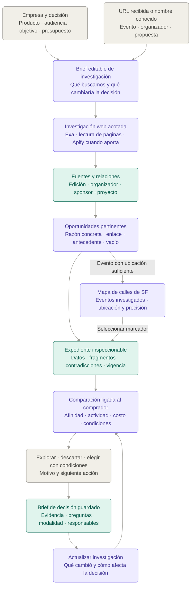

# Growth Atlas — investigar oportunidades y decidir dónde y cómo invertir en growth

10 de septiembre de 2026 · Redefinición de producto solicitada por Julian para DemoPuentes. Describe la experiencia de destino, el alcance de la demostración y la evolución posterior. Las capacidades nuevas se expresan como producto por construir; su presencia en este documento no significa que ya estén implementadas.

Este documento toma la estructura narrativa de `plan/finalProduct.md` y reemplaza su propuesta de producto para esta nueva dirección. Conserva la base técnica útil del repo y parte de la revisión de la app real. La implementación, los contratos, los tickets y el ADR deberán reflejar esta dirección al ejecutarla; aquí no se modifican esos archivos ni se inicia gasto en proveedores.

## Qué es y qué problema resuelve

**Growth Atlas es un motor de investigación y decisiones para equipos de growth que necesitan decidir dónde, cómo y bajo qué condiciones invertir para llegar a una audiencia concreta.**

Un equipo puede conocer bien su producto y aun así tomar una mala decisión de distribución. La información está fragmentada: una página anuncia un evento, una empresa publica que participó, una galería muestra proyectos y una propuesta comercial enumera beneficios difíciles de comparar. Reunir esas piezas consume tiempo; relacionarlas correctamente exige contexto. A veces se termina decidiendo por una marca conocida, una recomendación informal o una presentación atractiva.

El problema aparece antes de comprometer dinero: **¿esta oportunidad tiene sentido para nuestro producto y nuestro objetivo, qué actividad conviene explorar y qué tendría que ser cierto para que la inversión resulte razonable?**

Growth Atlas investiga a partir de esa pregunta. Busca oportunidades y fuentes, reconstruye antecedentes, distingue lo publicado de lo comprobado y produce una comparación ligada al contexto del comprador. Su salida principal es un **brief de decisión**: una explicación breve y verificable de qué explorar primero, qué descartar, qué sigue pendiente y cuál es la siguiente acción.

La entrada inicial serán **startups B2B de herramientas para desarrolladores que evalúan eventos, workshops y comunidades técnicas de San Francisco**. Este foco permite contrastar afinidad técnica con programas, proyectos publicados, empresas participantes y antecedentes concretos. La ambición es ampliar el método a otras decisiones de growth después de demostrar utilidad en ese ámbito.

El beneficio que buscamos es que el equipo descubra información material que no tenía, evite errores de interpretación y avance con una decisión mejor fundamentada. Una interfaz atractiva, un informe largo o muchas fuentes obtenidas no bastan para demostrarlo.

## Por qué cambia el foco y qué sabemos

**La revisión de la app encontró una separación entre infraestructura y utilidad percibida.** Ya existen persistencia, aislamiento entre tenants, workers, fuentes, comparaciones y decisiones. Sin embargo, los cuatro organizadores de la sesión revisada eran sintéticos y no había cargas de catálogo curado real. El recorrido principal consultaba ese catálogo; no salía a buscar antecedentes en la web.

**Las pruebas con fuentes reales mostraron una extracción insuficiente.** Al importar dos eventos de Luma, se conservaron datos básicos, pero se perdieron sponsors, audiencia, temas y condiciones visibles en las páginas. Una fuente tenía fechas distintas entre encabezado y descripción; la app eligió la fecha estructurada sin señalar la discrepancia. La información importante existía, pero no llegaba a la experiencia de decisión.

**La interfaz hacía más visible el sistema que su respuesta.** UUIDs, revisiones, pasos completados, timestamps y fuentes repetidas ocupaban el espacio principal. El enlace al evento real estaba dentro del dossier y no era una acción clara desde el resultado. El diseño contribuía a que trabajo técnicamente válido se percibiera como ruido.

**También existen defectos funcionales.** La auditoría encontró pérdida de incertidumbre en costos, presupuesto incompleto tratado como compatible, fechas contradichas sin condición, audiencia pendiente omitida, diferencias en el tratamiento de evidencia confirmada y navegación histórica que puede abrir datos actuales. Las pruebas automáticas existentes pasan, pero no cubren todos esos casos ni acreditan calidad comercial de los datos. [Auditoría completa](</Users/jirustaroure/Desktop/GrowthX for hackaton/docs/reviews/2026-09-10-auditoria-producto.md>).

**El discovery previo sigue siendo contexto, no validación comercial concluyente.** El registro de Terac describe investigación manual de trayectoria y audiencia antes de patrocinar. Las conversaciones adicionales reportadas por Julian señalan un dolor similar. No convertimos esos relatos en una tasa de éxito, una disposición a pagar demostrada o una descripción universal de todos los equipos de growth. [Registro de Terac](</Users/jirustaroure/Desktop/GrowthX for hackaton/docs/research/discovery-terac-2026-09.md>).

**La nueva dirección incorpora investigación web al centro del producto.** La restricción anterior de trabajar exclusivamente sobre un catálogo pequeño deja de definir esta propuesta. El catálogo pasa a ser la memoria de lo investigado y revisado. Exa y Apify pueden obtener nuevas fuentes; la aplicación debe convertirlas en información útil sin perder atribución, incertidumbre o contexto.

La hipótesis central queda así: **una investigación ligada al objetivo de una empresa puede descubrir un antecedente o una restricción que cambie su selección, su modalidad de participación o las condiciones que exige antes de pagar.** Esa hipótesis se comprueba con decisiones reales, no con el número de conectores integrados.

## Para quién construimos y qué decisión queremos mejorar

La primera experiencia se diseña alrededor de una empresa de software B2B que vende a desarrolladores o equipos técnicos. El producto puede ser una API, una herramienta de infraestructura, una plataforma de datos o un servicio de desarrollo. El ejemplo principal de la demo será una plataforma de observabilidad para agentes; ese comprador es ilustrativo hasta que una empresa real participe en la validación.

| Persona | Trabajo que necesita resolver | Qué espera de la app |
| --- | --- | --- |
| Responsable de growth | Encontrar oportunidades y justificar dónde dedicar tiempo y presupuesto | Opciones pertinentes, antecedentes útiles y una siguiente acción clara |
| DevRel o responsable técnico de comunidad | Entender si existe una actividad adecuada para el producto y su audiencia | Formatos, tecnologías, proyectos y condiciones de participación |
| Founder o directivo con presupuesto | Revisar la propuesta, sus riesgos y los supuestos principales | Un brief comprensible, costos separados y evidencia accesible |
| Persona que retoma una investigación | Continuar sin reconstruir todas las pestañas y conversaciones | Decisión original, preguntas abiertas y cambios posteriores |

La app distingue **el objetivo**, **la actividad** y **el resultado**. Conseguir que equipos prueben una API es un objetivo; un workshop es una actividad; cuántos equipos la activaron después sería un resultado. Elegir la actividad no demuestra que el resultado vaya a ocurrir.

El primer caso prioriza adopción o conversaciones técnicas cualificadas. Recruiting, ventas y reconocimiento de marca pueden registrarse como objetivos distintos, pero no reciben automáticamente las mismas razones de pertinencia ni las mismas métricas. Una política validada para un objetivo no se aplica silenciosamente a otro.

**DECISIÓN DE DIRECCIÓN:** comenzar con devtools, SF y decisiones previas a participar en eventos o comunidades. **HIPÓTESIS ABIERTA:** qué comprador concreto encuentra suficiente valor como para usar y pagar el producto de forma recurrente.

## Qué aprovechamos del repo y qué cambia

La base actual es Next.js con API, worker separado, PostgreSQL y pg-boss. Ya hay contratos, claims, catálogo por tenant, runs durables, snapshots, decisiones y borradores de campaña. La nueva experiencia aprovecha esa continuidad; no necesita reconstruir la infraestructura para empezar a investigar mejor.

| Parte del producto | Estado observado | Nueva función en esta dirección |
| --- | --- | --- |
| Perfil de empresa | Registra contexto; varios campos no influyen suficientemente en la investigación | Define la pregunta, las consultas, los criterios de afinidad y las restricciones |
| Catálogo | Almacena organizadores, eventos, participaciones y fuentes | Memoria versionada de investigaciones reales, con cobertura explícita |
| Investigación principal | Matching sobre datos ya cargados | Descubrimiento web acotado y profundización de las opciones pertinentes |
| Importación Luma | Extracción básica y persistencia | Entrada a una investigación del evento, su organizador y antecedentes |
| Exa / Apify | Conectores presentes principalmente en el recorrido antiguo | Obtención dirigida de fuentes y contenido para el recorrido principal |
| Evidencia | Claims y fuentes con estructura útil, con defectos en algunos consumidores | Soporte inspeccionable de cada afirmación material y de sus límites |
| Comparación | Factual, durable y sin política comercial aprobada | Lectura comprensible de ajuste, actividad, costo, evidencia y pendientes |
| Decisión y campaña | Persistencia disponible; experiencia de edición parcial | Brief útil para quien aprueba y borrador de la siguiente conversación |
| Dashboard | Mucho detalle técnico y baja jerarquía de respuesta | Oportunidades y conclusiones primero; auditoría técnica accesible a demanda |

La navegación de destino será **empresa y objetivo → investigación → oportunidades y antecedentes → comparación → brief de decisión → actualización explícita**. Se puede entrar también con una URL recibida o con el nombre de un organizador.

SF sigue siendo el ámbito geográfico inicial. Un antecedente de Berlín puede ayudar a comprender la experiencia de un organizador; no se convierte por ello en una oportunidad de SF. Ciudad del evento, ubicación de la empresa y domicilio del organizador son datos diferentes. Una comunidad sin actividad concreta sirve para investigar una relación, pero no equivale todavía a una alternativa de inversión.

## La app de un vistazo

Beige representa decisiones o aportes del equipo; violeta, trabajo de investigación y comparación; verde, información y decisiones conservadas. Los colores describen funciones, no grados de certeza. **El mapa de SF se conserva y se integra con los resultados investigados**, según la dirección adicional de Julian del 10 de septiembre. La persona puede trabajar desde la lista o el mapa sin perder su selección ni la evidencia.

## El paseo por la app

### 1. Abre una investigación sobre una decisión real

A la izquierda encuentra **Investigaciones, Oportunidades, Organizadores, Mapa de SF y Decisiones**. El perfil de empresa permanece accesible. El inicio muestra el trabajo que puede retomar y las preguntas que bloquean sus decisiones. Si aún no hay investigaciones, presenta una entrada sencilla: describir la empresa o pegar una URL.

La persona puede escribir su producto o aportar su sitio web. La app propone una interpretación con audiencia, caso de uso y tecnologías; distingue lo extraído del sitio de lo inferido. La persona puede corregirlo antes de investigar. Leer una web no autoriza a declarar que conocemos el posicionamiento o los objetivos internos de esa empresa.

El brief recoge producto, audiencia prioritaria, objetivo, presupuesto y moneda, fechas, ámbito geográfico y formatos que interesan. También puede incluir restricciones, empresas comparables indicadas por el comprador y una definición propia de éxito. Lo que aún no sabe queda abierto. Confirmar un objetivo significa que el comprador lo declaró, no que el producto haya validado su viabilidad.

Un brief ilustrativo sería: «Tenemos USD 5.000 para explorar actividades en SF durante las próximas seis semanas. Queremos que equipos que construyen agentes prueben nuestra plataforma. Nos interesan workshops y proyectos prácticos; una presencia de logo por sí sola no es el objetivo».

Desde ese momento la app investiga para responder esa pregunta. La descripción de producto y el objetivo deben influir de forma observable: cambiar de observabilidad para agentes a infraestructura de pagos debe cambiar consultas, evidencias buscadas y razones de pertinencia.

### 2. Entiende qué va a investigar la app

Antes de empezar ve una explicación breve: se buscarán actividades futuras compatibles, organizadores con antecedentes relevantes, empresas participantes y proyectos o recaps que ayuden a evaluar el ajuste. También se buscarán restricciones que puedan invalidar una opción.

La app propone una búsqueda acotada. Primero descubre candidatos; después profundiza en los más pertinentes. Para la primera versión, la experiencia se concentra en comparar hasta tres alternativas. No necesita investigar cada resultado con la misma profundidad ni llenar tres posiciones si solo una tiene soporte suficiente.

Si la entrada fue una URL, la investigación parte de esa edición y de sus relaciones. Si fue un organizador, intenta resolver su identidad y encontrar actividades concretas. Si fue un brief sin nombres, busca oportunidades nuevas. Los tres caminos convergen en los mismos expedientes y decisiones.

El usuario puede acotar el trabajo sin tener que escribir consultas de buscador ni configurar Actors. El costo operativo pertenece al detalle de la investigación; nunca se confunde con el presupuesto destinado a participar en un evento.

### 3. Ve progreso que se corresponde con hallazgos reales

Mientras trabaja, la pantalla explica qué está ocurriendo: encontrando fuentes, leyendo páginas, asociando ediciones o comprobando discrepancias. Las primeras oportunidades aparecen cuando cuentan con datos suficientes para ser útiles, aunque la investigación continúe.

Un progreso útil puede indicar que se encontró un recap o que hay dos fuentes con fechas distintas. La etiqueta solo aparece después de obtener ese resultado. Un documento descargado todavía no cuenta como un hecho validado ni como una relación confirmada.

La interfaz conserva contexto y evita que cada respuesta del servidor reorganice toda la pantalla. Se distinguen resultados provisionales, trabajo terminado y fuentes pendientes. Una demora de Apify no borra lo que ya se obtuvo por otra vía.

Si se alcanza el límite de consultas, una página falla o un proveedor no está disponible, la investigación termina con su cobertura real y un mensaje útil. Puede continuarse o reintentarse explícitamente. No se rellena la lista con fixtures y no se presenta una animación de búsqueda como prueba de trabajo nuevo.

### 4. Encuentra oportunidades con una razón concreta

La pantalla presenta una selección legible. Cada resultado permite reconocer **qué es, cuándo ocurre, quién lo organiza, por qué interesa y qué impide decidir todavía**. El enlace **Abrir evento** está visible desde la tarjeta o fila principal.

| Información del resultado | Pregunta que responde |
| --- | --- |
| Nombre, fecha, ciudad y enlace oficial | ¿Qué actividad concreta estamos evaluando? |
| Organizador y rol documentado | ¿Quién está detrás de esta edición? |
| Razón de pertinencia | ¿Qué relación tiene con nuestro producto y objetivo? |
| Antecedente destacado | ¿Qué encontramos que hace que merezca atención? |
| Formato publicado o actividad propuesta | ¿Cómo podríamos participar? |
| Precio conocido o costo pendiente | ¿Qué sabemos de la inversión necesaria? |
| Vacío o restricción principal | ¿Qué puede cambiar la decisión? |

La razón no se limita a «coincide con Python». Debe explicar la conexión entre el contexto del comprador y una evidencia concreta: temática de una actividad, proyectos de una edición previa, programa de workshop o participación de empresas pertinentes.

Puede filtrar por fecha, tema, formato y disponibilidad de información material. La afinidad y la calidad de evidencia se leen por separado. Una opción con buena documentación puede ser poco pertinente; una idea pertinente puede estar muy poco documentada.

Los resultados distinguen oportunidad futura, antecedente pasado y fecha o ciudad pendiente. La ausencia de ubicación impide dibujar un punto fiable en el mapa, pero no hace desaparecer la investigación. Eventos de otra ciudad conservan su alcance y no se incluyen como locales por similitud de nombre.

#### Ubica los eventos investigados en un mapa de calles

En escritorio puede ver resultados y mapa juntos; en una pantalla pequeña alterna entre ambos conservando filtros y selección. El mapa muestra calles, barrios, costa y referencias urbanas legibles. Reemplaza la cuadrícula SVG actual, no elimina la funcionalidad que el usuario quiere conservar.

Cuando una oportunidad investigada tiene coordenadas publicadas con soporte suficiente, aparece un marcador ligado a su edición. Si solo tiene una dirección pública, la app intenta resolverla a coordenadas y conserva método, fuente, precisión y fecha. Geocodificar una dirección anunciada no confirma que el evento vaya a celebrarse allí.

Una dirección completa resuelta permite un marcador de sede. Una calle sin altura solo admite una representación aproximada si existe resolución inequívoca, etiquetada y diferenciada del punto preciso; de lo contrario queda pendiente. Conocer únicamente la ciudad centra la vista, pero no crea un falso pin del venue. No se intenta reconstruir una dirección que la fuente oculta hasta completar el registro.

Seleccionar una tarjeta resalta y centra su marcador. Seleccionar un marcador resalta el mismo evento y permite abrir su dossier. La ficha del mapa muestra nombre, fecha, dirección o sede, motivo de pertinencia, estado de ubicación y **Abrir evento**. La posición no constituye una recomendación de invertir.

El mapa y la lista comparten investigación y filtros. La lista conserva los eventos sin punto y explica cuántos faltan ubicar. Una llegada nueva no mueve repetidamente la cámara mientras la persona explora; existe una acción explícita para encuadrar todos los resultados. Los eventos coincidentes en un venue se pueden distinguir. La actualización de una ubicación no desplaza el marcador histórico de una decisión guardada.

### 5. Abre un dossier que aporta más que la página original

El dossier comienza con una síntesis ligada al comprador: razones para explorar la oportunidad, límites y preguntas abiertas. Después permite inspeccionar evento, programa, audiencia, formatos, organizadores, empresas vinculadas, proyectos y costos. El objetivo es que la persona encuentre rápidamente la respuesta y pueda profundizar sin perder contexto.

La extracción considera tanto datos estructurados como contenido visible. Un campo JSON-LD es una fuente útil; no reemplaza la lectura de una descripción con sponsors, requisitos o fechas diferentes. Cuando dos partes de la misma página discrepan, ambas versiones se conservan y la contradicción se muestra como tal.

Una afirmación importante abre un panel lateral con URL, título, fragmento que la respalda, fecha de obtención y tipo de fuente. Desde allí puede abrirse la página original. La evidencia no se repite completa debajo de cada línea del dossier.

La pantalla distingue cuándo se leyó una fuente y cuándo una persona confirmó un dato. Una importación automática se presenta como extracción, no como verificación humana. El nombre del calendario tampoco se convierte automáticamente en organizador del evento.

### 6. Reconstruye la trayectoria del organizador

Desde el evento puede abrir el expediente del organizador. Encuentra una cronología de ediciones, temas, formatos, empresas participantes, proyectos vinculados y evidencia sobre lo que ocurrió. Cada relación vuelve a su edición y fuente.

La identidad se resuelve con elementos como enlaces oficiales, dominio, cuentas públicas relacionadas y atribuciones de organización. Nombres parecidos no son suficientes para unir historiales. Coorganizador, comunidad, venue, sponsor y calendario mantienen roles diferenciados.

Los antecedentes fuera de SF siguen siendo visibles con su ubicación real. Repetir una marca de evento no convierte todos sus años en una sola edición. Haber organizado algo en el pasado tampoco garantiza que la misma persona o empresa organice la edición futura.

El expediente ayuda a responder si el organizador tiene experiencia relevante para la actividad propuesta. No produce una reputación universal de «buen organizador». Las preguntas restantes pueden ser sobre composición de audiencia, entrega del formato, referencias de empresas participantes o posibilidad de realizar una actividad concreta.

### 7. Entiende qué significan sponsors, empresas y proyectos

La sección de empresas permite pasar de un nombre a su participación documentada. Muestra en qué edición aparece, con qué rol, en qué fuente y con qué nivel de certeza. Cuando el rol solo proviene de un logo, lo describe como mención o presencia pendiente de precisar.

Una empresa comparable se considera tal por indicación del comprador o por una relación explicada que este puede revisar. Compartir palabras como «AI» no establece competencia. Una participación repetida puede ser un antecedente interesante; no prueba satisfacción, pago, exclusividad ni retorno.

Los proyectos se presentan con título, enlace público, edición relacionada y tecnología o actividad que efectivamente se puede documentar. La app distingue proyecto mostrado en una galería, repositorio enlazado y uso técnico comprobado en el material disponible. Un repositorio genérico de GitHub no se atribuye a un evento porque use el mismo stack.

| Capa | Evidencia admisible | Qué permite decir |
| --- | --- | --- |
| Lo anunciado | Página, programa, propuesta o publicación del organizador | Audiencia objetivo, sponsors anunciados, formato previsto o beneficios ofrecidos |
| Lo ocurrido | Recap atribuido, galería vinculada, repositorio asociado o registro con método | Actividades o proyectos reportados; asistencia solo según el alcance de su fuente |
| Lo conseguido por una empresa | Caso o información autorizada con objetivo, período y método | Resultado atribuido por esa fuente, con sus límites |

Si se revisó solo una parte de una galería, cualquier conteo describe esa muestra. No se convierte en porcentaje de asistentes, cuota de mercado o tasa de adopción. Un premio en créditos no acredita ingresos ni equivale a efectivo gastado por el sponsor.

La utilidad de esta sección es conectar antecedentes con una hipótesis de actividad. Por ejemplo, evidencia de proyectos prácticos pertinentes puede apoyar explorar un workshop. Para saber si se puede realizar, cuánto cuesta y a quién accedería la empresa, todavía hacen falta condiciones de la edición concreta.

### 8. Compara alternativas que responden al mismo objetivo

La persona selecciona hasta tres opciones. La comparación conserva el mismo perfil y explicita las diferencias en audiencia, afinidad técnica, formato, antecedentes, acceso, fechas y costo. Si una alternativa no tiene modalidad definida, esa ausencia permanece visible.

La app separa tres preguntas: **¿podemos participar?, ¿por qué nos interesa?, ¿qué tan bien sabemos lo anterior?** Un impedimento de fecha, lugar o presupuesto se aplica antes de cualquier preferencia. Un dato desconocido no significa incompatibilidad confirmada, pero tampoco compatibilidad demostrada.

El resultado puede recomendar investigar una opción primero y explicar el criterio usado. Esa prioridad de investigación no es un score de retorno. La primera demo usa diferencias factuales y razones inspeccionables; no necesita un número de inversión ficticio para ordenar una conversación.

Cuando el producto incorpore una política de priorización, esta deberá ser explícita, versionada y adecuada al objetivo. Los pesos elegidos por un comprador son preferencias declaradas; no estadísticas empíricas. Cambiar objetivo o restricciones produce otra evaluación y explica por qué cambió el orden o la elegibilidad.

La comparación también puede concluir que ninguna alternativa tiene soporte suficiente para elegir. En ese caso, su resultado útil es identificar qué dato falta y qué opción merece la próxima comprobación.

### 9. Evalúa el presupuesto sin confundir información y supuestos

Los costos se separan por concepto: participación, viaje, materiales, personal, premios u otros compromisos. Cada partida conserva origen, moneda, fecha, estado y modalidad a la que corresponde. Se distingue cotización publicada o recibida, estimación del equipo y costo todavía pendiente.

Partidas que ocurren juntas se acumulan. Dos paquetes alternativos no se suman como si ambos se fueran a contratar. Si solo los costos conocidos ya superan el presupuesto, el conflicto existe aunque falten otras partidas. Si el costo está incompleto, que una partida aislada entre en presupuesto no acredita que toda la actividad entre.

Monedas diferentes requieren una conversión explícita con fecha y supuesto, o permanecen incomparables. No se inventan tarifas a partir de premios, precios de tickets o créditos anunciados. Un costo contradicho conserva su contradicción al guardarse en campaña.

En la evolución posterior, el comprador puede explorar escenarios: cambiar presupuesto, elegir otra modalidad o incluir una estimación propia. El sistema recalcula restricciones y muestra qué supuesto cambió. Si se incluyen objetivos de conversión, son hipótesis editables; no predicciones disfrazadas de resultados.

La demo inicial muestra costos y condiciones conocidos o pendientes. Los escenarios interactivos completos no deben bloquear la investigación útil ni la grabación.

### 10. Guarda un brief que otra persona puede entender

La persona elige, descarta o deja pendiente, con un motivo. Puede decidir explorar primero una oportunidad o elegir una participación sujeta a condiciones. Las condiciones incluyen pregunta, respuesta que permitiría avanzar, consecuencia, responsable y plazo cuando corresponda.

La salida reúne el contexto del comprador, alternativas revisadas, razonamiento, evidencia material, presupuesto documentado, pendientes y siguiente acción. Un directivo debe poder leer la síntesis sin reconstruir todo el historial y abrir fuentes si quiere cuestionarla.

El borrador de campaña permite registrar una modalidad propuesta, compromisos conocidos y preguntas. Distingue una oferta real de una idea del equipo. Una actividad no publicada puede formularse como consulta al organizador, nunca como inventario comprable confirmado.

Se puede copiar un mensaje específico: pedir condiciones del workshop, precio completo, forma de acceso o evidencia sobre la audiencia. La aplicación prepara esa conversación; guardar o copiar no contacta automáticamente a nadie ni compromete presupuesto.

### 11. Reabre y entiende qué cambió

Al volver, recupera el mismo brief, revisión de las fuentes, motivos y condiciones que sustentaban la decisión. Abrir un dossier desde una decisión histórica conserva el contexto histórico; una vista de datos actuales se identifica expresamente.

Si solicita actualizar la investigación, el sistema obtiene una nueva revisión y presenta diferencias materiales: cambió una fecha, apareció un recap, se recibió una cotización o una fuente dejó de estar accesible. La lectura nueva explica qué consecuencias tiene cada cambio y conserva la decisión anterior.

Una pregunta pendiente se resuelve con su respuesta, quién la aportó y qué soporte existe. Una confirmación interna del comprador se atribuye a él; no se convierte en una confirmación del organizador. Las revisiones posteriores no reescriben silenciosamente el razonamiento original.

El refresh explícito pertenece al destino del producto. La demo necesita demostrar al menos persistencia y reapertura fiables; el monitoreo programado será una ampliación posterior.

## Cómo investiga: Exa, Apify y el trabajo propio del producto

La investigación tiene una pregunta y límites. El sistema descubre candidatos, lee fuentes, extrae afirmaciones, relaciona entidades, conserva discrepancias y prepara una comparación. Cada etapa produce información persistida que puede inspeccionarse y reutilizarse.

| Etapa | Medio previsto | Responsabilidad de Growth Atlas |
| --- | --- | --- |
| Entender la empresa | Descripción del comprador y, si la aporta, su web | Proponer un brief editable y distinguir datos declarados de interpretación |
| Descubrir oportunidades | Exa Search | Formular consultas pertinentes, comprobar fechas y geografía, deduplicar candidatos |
| Encontrar antecedentes | Exa sobre organizador, edición, empresa o proyecto | Buscar soporte de afinidad y posibles restricciones, sin confundir menciones con relaciones |
| Leer páginas conocidas | Fetch controlado y Exa Contents | Conservar contenido útil, fecha de obtención y enlace canónico |
| Obtener contenido adicional | Apify cuando una página requiere renderizado o un recorrido acotado | Elegir fuentes, limitar el trabajo y medir si aporta evidencia adicional |
| Extraer hechos | Parsers y extracción estructurada asistida por modelo cuando corresponda | Exigir fragmentos, atributos y entidades; rechazar datos sin soporte suficiente |
| Relacionar antecedentes | Código propio y revisión de ambigüedades | Asociar evento, edición, empresa, rol y proyecto sin fusiones por parecido |
| Comparar y explicar | Reglas de restricciones y síntesis sobre evidencia admitida | Separar elegibilidad, pertinencia, calidad de evidencia y preferencia del comprador |
| Conservar la decisión | PostgreSQL, worker, snapshots y revisiones existentes | Permitir reapertura, trazabilidad y actualización explícita |

**Exa es la entrada de descubrimiento.** La investigación combina consultas de oportunidades futuras con otras sobre antecedentes concretos. El nombre de un sponsor o un organizador encontrado puede abrir una búsqueda adicional, siempre que ayude a responder una pregunta del brief. No se expande indefinidamente por todos los enlaces disponibles. [Search](https://exa.ai/docs/reference/search) y [Contents](https://exa.ai/docs/reference/get-contents).

**Apify resuelve obtención de contenido.** El primer candidato a evaluar es [Website Content Crawler](https://apify.com/apify/website-content-crawler), mantenido por Apify. Sirve para obtener texto de sitios y páginas elegidos; Growth Atlas sigue siendo responsable de entender qué afirma ese texto y a qué edición corresponde. No se ejecuta un Actor si la misma evidencia ya se obtuvo correctamente por una vía más sencilla.

**X y LinkedIn pueden aportar fuentes útiles.** Se consideran publicaciones relacionadas con organizadores, sponsors o ediciones concretas: anuncios, recaps, demostraciones o referencias a una actividad. La elección de Actor depende de una prueba pequeña de disponibilidad, calidad y costo. El scraper antiguo del repo no queda validado para este nuevo uso por estar integrado. La primera demo puede completarse con fuentes web si estas ya sostienen el caso.

**El modelo ayuda a interpretar y redactar.** No convierte una fuente en soporte universal ni sustituye la lógica de presupuesto, fechas o acceso. Un formato JSON válido y un ID de cita existente no prueban que una oración esté respaldada. Las frases factuales de la primera entrega deben derivarse de campos y fragmentos admitidos; las hipótesis de actividad se presentan como propuestas.

La investigación automática no requiere que una persona apruebe cada página encontrada. Las ambigüedades se conservan y no adquieren certeza por automatización. La revisión humana se concentra en afirmaciones decisivas, identidades inciertas y condiciones que necesitan respuesta del comprador u organizador.

### Qué conservamos de cada afirmación

Cada dato material identifica entidad y edición, atributo, valor, estado, fuente, fragmento y fecha de obtención. Cuando corresponda también registra fecha de publicación, alcance geográfico y quién confirmó o corrigió el dato. El estado puede ser anunciado, reportado, observado, inferido, confirmado, pendiente o contradicho; sus consumidores deben respetar el mismo significado.

La cobertura se expresa sobre lo realmente revisado. Tres fuentes copiando un mismo anuncio no cuentan como tres verificaciones independientes. Una fuente inaccesible no invalida automáticamente todo lo observado antes, pero su estado actual y antigüedad permanecen visibles.

El contenido recuperado se trata como datos externos. Sus instrucciones no cambian el objetivo de la investigación ni las reglas de la aplicación. Las claves de proveedores permanecen en servidor y no aparecen en fuentes, briefs o mensajes de progreso.

### Límites, reutilización y errores

Cada investigación tiene límites de consultas, páginas, profundidad, duración y consumo. Deduplica URLs equivalentes y reutiliza contenido conservando su antigüedad. La reutilización no se presenta como lectura nueva. Una nueva fuente crea otra revisión, sin sobrescribir evidencia usada por una decisión previa.

Si faltan claves, se agota el presupuesto o una fuente falla, la aplicación conserva los resultados obtenidos e identifica la parte incompleta. El retry se refiere a una etapa concreta y evita duplicar efectos persistidos. Un expediente vacío debe explicar qué se buscó, qué no se pudo obtener y qué entrada adicional permitiría avanzar.

## La experiencia visual que queremos conseguir

La interfaz debe permitir comprender la decisión antes de inspeccionar cómo funciona el sistema. Su jerarquía es **respuesta → diferencias materiales → evidencia → detalle técnico**.

En escritorio, el brief permanece compacto, las oportunidades ocupan el área central y una evidencia se abre a un lado sin reemplazar toda la comparación. La tipografía, el espaciado y las etiquetas diferencian títulos, conclusiones, condiciones y soporte. Evitamos tarjetas anidadas, bloques repetidos y párrafos que explican infraestructura donde el usuario necesita decidir.

La primera pantalla útil muestra nombre del evento, fecha legible, motivo de pertinencia, pendiente principal y enlace. Una afirmación importante tiene una acción de evidencia reconocible. La condición no depende solo de un color: se escribe qué falta y qué consecuencia tiene.

Las capturas y pruebas de aceptación deben incluir una laptop de 1366×900 y un ancho reducido. En pantallas pequeñas la comparación puede apilarse y el panel de evidencia convertirse en una vista completa. Ninguna fuente, condición o acción principal debe quedar inaccesible por falta de ancho. La aceptación móvil todavía no está demostrada por la auditoría anterior.

Para Puentes, la interfaz y el video serán consistentes en inglés. Este documento se mantiene en español para definir el producto. Fechas y moneda se muestran de forma humana; UUIDs, intentos del worker y nombres de contratos se consultan en el detalle técnico.

| Estado de la experiencia | Comportamiento esperado |
| --- | --- |
| Primera visita | Entrada clara y ejemplo marcado como ilustrativo |
| Investigación en curso | Progreso real, resultados provisionales estables y posibilidad de retomar |
| Cobertura insuficiente | Explicación concreta, sin recomendaciones de relleno |
| Contradicción | Versiones y fuentes visibles; condición que conserva el conflicto |
| Costo pendiente | Incógnita explícita, sin total engañoso ni compatibilidad supuesta |
| Error de una fuente | Resultado parcial utilizable y causa identificable |
| Decisión guardada | Síntesis, condiciones y siguiente acción reconocibles |
| Investigación actualizada | Diferencias respecto de la evaluación original |

## Casos de uso dentro de esta dirección

| Caso | Quién y cuándo | Qué obtiene | Qué cuenta como valor |
| --- | --- | --- | --- |
| Descubrir oportunidades | Growth tiene objetivo y presupuesto, sin una propuesta concreta | Opciones encontradas y razones ligadas al producto | Encuentra una opción pertinente que no había considerado |
| Evaluar una URL recibida | Alguien propone participar en un evento | Dossier conectado con organizador y antecedentes | Resuelve preguntas que la página aislada no contestaba |
| Investigar un organizador | Le recomiendan un nombre | Identidad, ediciones, roles y trayectoria documentada | Distingue experiencia relevante de una reputación informal |
| Revisar empresas comparables | Necesita comprender dónde y cómo participaron otras empresas | Relaciones empresa–edición–rol con fuente | Descubre un formato o antecedente para investigar |
| Investigar proyectos | DevRel quiere saber si hay afinidad técnica | Proyectos vinculados y evidencia de tecnologías usadas | Formula una actividad técnica pertinente |
| Ubicar oportunidades | Growth encuentra un evento relevante o explora los resultados en SF | Mapa de calles con marcadores conectados a las fichas y precisión declarada | Reconoce el lugar y abre el mismo expediente desde el mapa |
| Comparar alternativas | El equipo tiene dos o tres posibilidades | Diferencias de ajuste, condiciones y costos | Cambia o justifica su selección con evidencia |
| Preparar aprobación interna | Un directivo revisa una propuesta de gasto | Brief corto con argumentos y pendientes | Comprende y cuestiona la propuesta sin rehacer la investigación |
| Preparar una conversación | Faltan acceso, precio o condiciones del formato | Preguntas específicas y modalidad propuesta | La próxima conversación puede resolver un bloqueo real |
| Retomar o actualizar | Aparecen condiciones nuevas o vuelve otro integrante del equipo | Versión original y cambios explícitos | Continúa el trabajo sin perder el razonamiento |
| Explorar escenarios posteriores | Cambia el presupuesto o la modalidad | Consecuencias de supuestos editables | Identifica qué condición cambia la viabilidad |

## Cómo se lo vendemos a un equipo de growth

La conversación comercial empieza con una decisión que el equipo tenga pendiente. Pedimos contexto del producto, alternativas consideradas y preguntas que necesita responder. El resultado debe ayudar en esa decisión concreta.

> «Contanos qué vendés, a quién querés llegar y qué presupuesto tenés. Investigamos oportunidades y antecedentes, te mostramos qué actividad tiene sentido explorar y qué evidencia respalda esa lectura. Te llevás una decisión explicada y las condiciones que falta resolver antes de invertir».

La comparación práctica es con el trabajo que ya hacen: contactos, páginas, buscadores, notas y asistentes. Nuestra hipótesis de diferenciación está en conectar ese material con el perfil del comprador, conservar las relaciones correctas y producir una decisión que se puede retomar. No afirmamos superioridad sin observarla.

Un directivo recibe una síntesis; una persona de growth puede inspeccionar todas las fuentes. El brief no reduce la investigación a un párrafo persuasivo: permite cuestionar una afirmación, modificar una preferencia o registrar que una condición sigue abierta.

**HIPÓTESIS COMERCIAL:** probar primero una investigación sobre una decisión real y después evaluar si conviene cobrar por investigación, por equipo o por acceso recurrente. El precio, la frecuencia de uso y la disposición a pagar siguen por validar.

## Demo de dos minutos para Puentes

La [página del programa](https://puentes.antigravity.capital/) consultada el 9 de septiembre indica cierre el 10 de septiembre a las 20:00 PT y revisión técnica de un repositorio en la segunda ronda. El [formulario](https://antigravity-room.notion.site/625daeb2902683fa8c69819d21c7b20a), leído en Chrome, pide un video en inglés de hasta dos minutos mediante YouTube o Loom. Esas condiciones definen el formato de esta entrega.

El comprador ilustrativo será una plataforma de observabilidad para agentes con USD 5.000 y una audiencia técnica definida. Los eventos, fuentes y antecedentes del recorrido deberán ser reales. El perfil ilustrativo no se presenta como cliente ni la grabación como validación comercial.

| Tiempo | Qué mostramos | Qué queda claro |
| --- | --- | --- |
| 0:00–0:15 | Producto, audiencia, objetivo y presupuesto | Hay una decisión concreta que resolver |
| 0:15–0:35 | Investigación, oportunidades y un evento ubicado en el mapa de SF | La aplicación obtiene información real y conecta el resultado con su ubicación |
| 0:35–1:10 | Un antecedente útil, fuente y conexión con el comprador; una restricción material | La investigación aporta algo que cambia la evaluación |
| 1:10–1:35 | Comparación y elección de qué explorar primero | La salida incluye razonamiento y condiciones |
| 1:35–1:50 | Guardar y reabrir el brief | El trabajo conserva evidencia y continuidad |
| 1:50–2:00 | Una decisión técnica propia y su propósito | El autor entiende cómo se obtiene y protege el resultado |

**El momento central es un hallazgo que cambia la decisión.** La contradicción de fechas detectada en la auditoría puede demostrar manejo de incertidumbre, pero necesitamos además un antecedente pertinente que ayude a elegir. El ejemplo de un organizador con workshops y proyectos compatibles describe el hallazgo buscado; no se presentará como descubierto hasta encontrar sus fuentes.

La investigación puede prepararse y persistirse para que la grabación sea fluida, mostrando fecha y origen. Si se edita una espera, no se atribuye al sistema una latencia inexistente. Una investigación preparada con fuentes reales es distinta de una respuesta escrita manualmente para simular una búsqueda.

El video se acompaña de un README coherente con la app y un recorrido reproducible. Si el despliegue compartido no está listo, puede grabarse el funcionamiento local real y explicar ese alcance. Se reserva tiempo para subir, reproducir y verificar el video; un despliegue nuevo no debe consumir esa reserva.

## Qué entra en la primera entrega y qué viene después

| Área | Necesario para la demo | Evolución posterior |
| --- | --- | --- |
| Entrada | Un brief editable o una URL, con producto y objetivo claros | Lectura más completa del sitio y múltiples perfiles |
| Investigación | Exa integrado en un recorrido durable y acotado | Descubrimiento más amplio y expansión por relaciones |
| Extracción | Contenido suficiente de las fuentes decisivas | Cobertura de más formatos, fuentes sociales y documentos |
| Apify | Usarlo si una fuente material lo necesita y la prueba funciona | Actors adicionales con calidad y consumo medidos |
| Datos | Objetivo de tres opciones reales y antecedentes de dos organizadores, si existe soporte | Catálogo enriquecido y cobertura sostenida |
| Decisión | Comparación factual, condiciones, brief y reapertura | Escenarios y políticas explícitas por objetivo |
| Actualización | Conservar la evidencia de la decisión | Refresh con diferencias; monitoreo programado más adelante |
| Experiencia | Pantalla principal legible y enlaces visibles | Colaboración, vistas y refinamiento de uso recurrente |
| Mapa | Calles de SF, al menos un evento real con ubicación respaldada y selección sincronizada con resultados | Mejoras de agrupación y exploración espacial según la cantidad de resultados |
| Operación | Entorno demostrado y reproducible | Onboarding y operación compartida validados |

El orden empieza por encontrar una historia real en las fuentes. En una comprobación inicial de 60–90 minutos se evalúa si el caso elegido aporta antecedentes suficientes. Si no ocurre, se cambia el ejemplo o se reduce el número de alternativas; no se fabrica evidencia para completar una composición visual.

Después se fija el conjunto de datos que necesita la experiencia y se trabaja en investigación y presentación en paralelo. Antes de grabar, el recorrido integrado debe superar los criterios de evidencia y decisión. Si la búsqueda general no está lista, puede mostrarse investigación real a partir de URLs elegidas y describir exactamente esa capacidad.

El alcance de demo no justifica ocultar los defectos encontrados. Costos inciertos, partidas acumulables, audiencia pendiente, contradicciones y soporte de afirmaciones son bloqueantes donde afecten el recorrido. Los hallazgos restantes se conservan como trabajo pendiente hasta verificarlos; no se declaran resueltos por evitar una pantalla.

## Créditos, consumo y economía de la investigación

Las capturas aportadas muestran USD 70 disponibles en Exa y USD 105 de uso disponible en Apify. La captura de Apify corresponde al período indicado hasta el 17 de septiembre; no establece por sí sola cómo vence o se renueva ese beneficio.

| Uso propuesto | Exa | Apify |
| --- | --- | --- |
| Prueba pequeña de fuentes y extracción | Hasta USD 5 | Hasta USD 10 |
| Integración, ensayos y demo | Hasta USD 5 adicionales | Hasta USD 5 adicionales |
| Saldo inicialmente sin asignar | USD 60 | USD 90 |

Son topes de planificación, no consumo realizado. Antes de ampliar se mide cuánto cuesta obtener evidencia útil y cuántas páginas o llamadas aportan información adicional. La aplicación registra el consumo de investigación separado del presupuesto comercial del comprador.

Según la [tarifa de Exa consultada](https://exa.ai/docs/reference/pricing), mil búsquedas estándar de hasta diez resultados cuestan USD 7 y mil páginas de un tipo de contenido cuestan USD 1. Mil búsquedas y tres mil páginas de texto darían una referencia de USD 10 bajo esas condiciones; no equivalen a mil investigaciones completas y otras opciones agregan cargos.

[Apify depende del Actor y los recursos](https://docs.apify.com/actors/running/actors-in-store). Se prueba una muestra y se fijan límites de páginas, profundidad, duración y concurrencia. Un límite de cobro por eventos no se asume como un tope universal de todos los costos. El consumo de un modelo externo se calcula aparte: esos créditos no acreditan saldo en otro proveedor.

## Cómo comprobamos que esta redefinición aporta valor

La aceptación combina producto, evidencia y funcionamiento. Los fixtures siguen siendo útiles para probar casos controlados, pero no sustituyen un recorrido con fuentes actuales.

| Dimensión | Criterio observable |
| --- | --- |
| Comprensión | Una persona puede explicar qué decisión ayuda a tomar después de ver la demo |
| Utilidad | Al menos un antecedente o restricción aporta información nueva y modifica una selección, condición o siguiente acción |
| Pertinencia | Cambiar producto u objetivo modifica consultas o razones de forma comprensible |
| Evidencia | Cada afirmación decisiva abre un fragmento que la respalda y corresponde a la entidad y edición correctas |
| Sponsors y proyectos | Los roles y vínculos están documentados; no se inventan participación pagada, uso técnico ni resultados |
| Presupuesto | Las partidas acumulables, pendientes, monedas y alternativas se tratan correctamente |
| Incertidumbre | Audiencia, acceso, fecha o costo insuficientes permanecen visibles en la decisión |
| Interfaz | Nombre, razón, condición y enlace son accesibles sin recorrer metadatos extensos |
| Mapa | Un evento investigado con ubicación suficiente aparece en el mapa; lista, marcador y dossier conservan identidad; una ciudad sola no inventa un venue |
| Persistencia | Al reabrir se conservan motivos, fuentes y revisiones; la actualización no cambia el pasado |
| Operación | Errores de proveedor producen resultados parciales explícitos y consumo trazable |

Después de postular, la validación propuesta consiste en observar al menos tres personas de growth o DevRel trabajando sobre una decisión propia. Registramos qué información desconocían, qué pregunta se resolvió, qué cambió y cuánto trabajo requirió. El tiempo se compara con una tarea manual equivalente; no se anuncia un porcentaje de ahorro sin medirlo.

Se mide por separado calidad de fuentes, exactitud de las relaciones, utilidad de la síntesis y disposición a volver o pagar. Una página adicional puede mejorar cobertura sin mejorar la decisión. Una demo convincente tampoco demuestra por sí sola demanda comercial.

## Qué queda fuera

- Resolver todas las decisiones de growth o comparar todos los canales de adquisición en la primera entrega.
- Un directorio global, un ranking de países o un catálogo exhaustivo de SF.
- Predicciones de ROI, ventas o contratación sin datos y método que las sostengan.
- Reputación universal de organizadores, éxito deducido de logos o popularidad convertida en retorno.
- Atribuir proyectos, asistentes o sponsors a una edición por parecido de nombres.
- Acceso supuesto a contratos, listas privadas de asistentes o métricas internas de otras empresas.
- Ranking de personas, reclutamiento individual o enriquecimiento masivo de perfiles.
- Ticketing, pagos, reservas, negociación o envío automático de mensajes.
- Un feed social generalista, monitoreo continuo o múltiples Actors como requisito para el primer video.
- Captura de outcomes, cohortes y aprendizaje comercial automático antes de validar la investigación previa.
- Reescribir toda la infraestructura, construir un nuevo mapa global o inventar scores para embellecer la demo.

Estas exclusiones acotan la entrega. La investigación web y el uso dirigido de Exa/Apify sí forman parte de la nueva dirección, aunque estuvieran fuera del plan anterior.

## Base de producto y revisión

Esta definición se apoya en la [auditoría de producto y código](</Users/jirustaroure/Desktop/GrowthX for hackaton/docs/reviews/2026-09-10-auditoria-producto.md>), la [propuesta de demo discutida](</Users/jirustaroure/Desktop/GrowthX for hackaton/plan/propuesta-demo-puentes-2026-09-10.md>) y el [discovery previo](</Users/jirustaroure/Desktop/GrowthX for hackaton/docs/research/discovery-terac-2026-09.md>). El [documento anterior](</Users/jirustaroure/Desktop/GrowthX for hackaton/plan/finalProduct.md>) se usó como formato narrativo, no como límite inmutable de alcance.

La ejecución se organiza en [implementation-plan.md](</Users/jirustaroure/Desktop/GrowthX for hackaton/DemoPuentes/implementation-plan.md>), con criterios transversales en [spec.md](</Users/jirustaroure/Desktop/GrowthX for hackaton/DemoPuentes/spec.md>) y un archivo por ticket en `DemoPuentes/issues/`.

Se aprovechan el [dashboard actual](</Users/jirustaroure/Desktop/GrowthX for hackaton/frontend/components/research-dashboard/research-dashboard.tsx>), la [investigación persistida](</Users/jirustaroure/Desktop/GrowthX for hackaton/frontend/lib/server/evaluations/research.ts>), el [importador Luma](</Users/jirustaroure/Desktop/GrowthX for hackaton/frontend/lib/server/catalog/luma-adapter.ts>), la [comparación](</Users/jirustaroure/Desktop/GrowthX for hackaton/frontend/lib/server/evaluations/compare.ts>) y las [decisiones](</Users/jirustaroure/Desktop/GrowthX for hackaton/frontend/lib/server/decisions/store.ts>). El [ADR](</Users/jirustaroure/Desktop/GrowthX for hackaton/docs/adr/0001-arquitectura-agente-growth-atlas.md>) y los [contratos actuales](</Users/jirustaroure/Desktop/GrowthX for hackaton/frontend/lib/contracts/evaluation.ts>) explican la base que deberá evolucionar.

Quedan por concretar al ejecutar: los eventos y antecedentes de la demo, las consultas y límites iniciales, el Actor necesario según las fuentes, el modelo de extracción y su costo, y el entorno en que se mostrará. El comprador real, la política comercial y el precio del producto se validarán con uso. Esas decisiones no deben confundirse con dudas sobre la dirección principal: **investigar información valiosa, relacionarla con el contexto del comprador y convertirla en una decisión comprensible que conserve su evidencia.**
