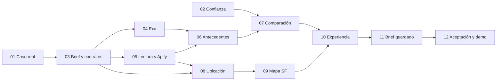

# DemoPuentes — plan de implementación

10 de septiembre de 2026 · Plan y doce tickets creados a pedido de Julian. **Avance consolidado: DP-01 a DP-11 verificados; DP-12 pendiente.** DP-10 integra brief, oportunidades, lista/mapa y evidencia; DP-11 completa decisiones, campaña, copia y reapertura por revisión. Ambos tienen pruebas aisladas y revisión en Chrome sobre localhost. Los cierres individuales son la fuente de verdad; este avance no acredita todavía la aceptación global de la demo.

## Resultado que vamos a entregar

Una empresa describe producto, audiencia, objetivo y presupuesto. La aplicación investiga oportunidades reales, reconstruye antecedentes útiles y muestra los eventos en una lista conectada con un mapa de calles de SF. El equipo puede inspeccionar una fuente, comparar alternativas, guardar una decisión con condiciones y reabrir la misma evidencia.

El mapa se conserva como una entrada importante al resultado. Una oportunidad relevante con ubicación suficiente aparece en él; seleccionar el marcador y seleccionar su tarjeta son dos formas de abrir el mismo evento.

## Documentos y tickets

- [Definición del producto](</Users/jirustaroure/Desktop/GrowthX for hackaton/DemoPuentes/finalProduct.md>): experiencia de destino y alcance.
- [Especificación de entrega](</Users/jirustaroure/Desktop/GrowthX for hackaton/DemoPuentes/spec.md>): criterios comunes y casos de aceptación.
- Este plan: orden, dependencias y decisiones de ejecución.
- `DemoPuentes/issues/`: un archivo por ticket, con objetivo, criterios, demostración y verificación.

Para esta iniciativa se concentra el material en la carpeta DemoPuentes solicitada. Se conserva el formato del tracker local —un archivo numerado por ticket, Status y Comments— sin duplicar estos tickets en .scratch ni mezclar su numeración con la iniciativa anterior.

## Qué nos dice el código actual

La infraestructura de PostgreSQL, worker, cola, contratos, catálogo y decisiones se reutiliza. No se reactiva el pipeline mundial como sustituto de investigación real. El árbol de trabajo ya tiene cambios del usuario: registrar el estado inicial y conservarlos; no asumir que HEAD contiene todo lo revisado.

La revisión inicial encontró una cuadrícula SVG y pérdida de streetAddress. Los cierres DP-08/09 ya incorporaron ubicación pública con procedencia y un mapa de calles de SF con MapLibre/OpenFreeMap. DP-10 reutiliza esa política, las revisiones del run y la comparación de DP-07 para presentar lista/mapa, evidencia y acciones. No reconstruir esas fuentes de verdad ni volver a tratar ciudad sola como coordenada de venue.

## Orden de implementación

| Ticket | Trabajo | Blocked by | Execution |
| --- | --- | --- | --- |
| [DP-01](</Users/jirustaroure/Desktop/GrowthX for hackaton/DemoPuentes/issues/01-caso-real-y-fuentes.md>) | Encontrar un caso real que justifique la demo | Ninguna | verified |
| [DP-02](</Users/jirustaroure/Desktop/GrowthX for hackaton/DemoPuentes/issues/02-confianza-costos-y-evidencia.md>) | Corregir los defectos que pueden distorsionar una decisión | Ninguna | verified |
| [DP-03](</Users/jirustaroure/Desktop/GrowthX for hackaton/DemoPuentes/issues/03-brief-y-contratos-de-investigacion.md>) | Definir un brief operativo y contratos compartidos | DP-01 | verified |
| [DP-04](</Users/jirustaroure/Desktop/GrowthX for hackaton/DemoPuentes/issues/04-discovery-exa-durable.md>) | Descubrir oportunidades y fuentes con Exa | DP-03 | verified |
| [DP-05](</Users/jirustaroure/Desktop/GrowthX for hackaton/DemoPuentes/issues/05-lectura-completa-y-apify.md>) | Leer contenido completo e incorporar Apify donde aporta | DP-03 | verified |
| [DP-06](</Users/jirustaroure/Desktop/GrowthX for hackaton/DemoPuentes/issues/06-organizador-sponsors-y-proyectos.md>) | Relacionar organizadores, sponsors y proyectos con la edición correcta | DP-04, DP-05 | verified |
| [DP-07](</Users/jirustaroure/Desktop/GrowthX for hackaton/DemoPuentes/issues/07-comparacion-y-recomendacion-explicable.md>) | Comparar opciones y explicar qué investigar primero | DP-02, DP-03, DP-06 | verified |
| [DP-08](</Users/jirustaroure/Desktop/GrowthX for hackaton/DemoPuentes/issues/08-direccion-a-coordenadas.md>) | Conservar ubicación y resolver direcciones a coordenadas | DP-03, DP-05 | verified |
| [DP-09](</Users/jirustaroure/Desktop/GrowthX for hackaton/DemoPuentes/issues/09-mapa-sf-integrado.md>) | Construir el mapa de calles de SF conectado a resultados | DP-08 | verified |
| [DP-10](</Users/jirustaroure/Desktop/GrowthX for hackaton/DemoPuentes/issues/10-experiencia-investigacion-y-evidencia.md>) | Renovar la experiencia principal de investigación | DP-03, DP-07, DP-09 | verified |
| [DP-11](</Users/jirustaroure/Desktop/GrowthX for hackaton/DemoPuentes/issues/11-brief-decision-y-reapertura.md>) | Guardar un brief accionable y reabrir la evidencia original | DP-07, DP-10 | verified |
| [DP-12](</Users/jirustaroure/Desktop/GrowthX for hackaton/DemoPuentes/issues/12-aceptacion-real-y-demo-puentes.md>) | Cerrar la aceptación con datos reales y preparar la demo | DP-01, DP-02, DP-03, DP-04, DP-05, DP-06, DP-07, DP-08, DP-09, DP-10, DP-11 | pending |

DP-01: [caso y fuentes](evidence/dp-01-caso-y-fuentes.md) · [antecedentes](evidence/dp-01-antecedentes.md) · [matriz de verificación y handoff](evidence/dp-01-verificacion.md). Tres futuras SF; [fichas de organizadores](evidence/dp-01-organizadores.md), **dos organizadores con antecedentes, uno con historial como organizador**, y una ubicación pública. AIT organizó en SF; Vultr patrocinó en París. La ciudad no invalida el antecedente ni el patrocinio acredita organización; [soporte por afirmación](evidence/dp-01-afirmaciones.md). La validación comercial sigue pendiente. Estado de los demás tickets: consultar sus Execution como fuente de verdad.

DP-02: [matriz de aceptación, evidencia y handoff](evidence/DP-02/README.md). 238 pruebas de funciones/integración y 25 comprobaciones E2E aprobadas, sin omisiones. Costos, condiciones, fecha local, confirmed y resúmenes factuales corregidos; no introduce política comercial.

DP-03: [matriz de aceptación, contratos y evidencia](evidence/DP-03/README.md). Brief editable/versionado, preguntas derivadas, fuentes con fragmentos, relaciones y ubicación con precisión; identidad/revisión compartida y cupos separados del presupuesto comercial. 245 pruebas y 26 comprobaciones E2E aprobadas, sin omisiones, más TypeScript, ESLint y build. DP-03 no requirió migración SQL; las integraciones siguen en sus tickets.

DP-04: [matriz de aceptación, smoke real y recuperación](evidence/DP-04/README.md). Consultas trazables al brief, propuestas de fuentes del tenant, progreso persistido y reserva agregada antes de cada intento. 262 pruebas y 27 comprobaciones E2E aprobadas, más TypeScript, ESLint y build. Una consulta real con la clave propia: cinco páginas y USD 0,007 informados por Exa; reserva USD 0,02. Reapertura y reinicio sin repetir consumo. Migración `007` aplicada al entorno local. DP-05 recibe URLs, candidatos y sourceIds; DP-06 todavía requiere su lectura e identidad de edición.

DP-05–09: cierres individuales consolidados desde [lectura de fuentes](evidence/DP-05/README.md), [relaciones](evidence/DP-06/README.md), [comparación explicable](evidence/DP-07/README.md), [ubicación](evidence/DP-08/README.md) y [mapa](evidence/DP-09/README.md). Sus tickets ya estaban verified al comenzar DP-10; esta actualización corrige el índice anterior.

DP-10: [matriz, recorridos y conservación](evidence/DP-10/README.md). Brief compacto editable, respuestas/acciones visibles, progreso persistido, lista/mapa y evidencia lateral o móvil, auditoría desplegable, fechas y etiquetas en inglés. 339 pruebas de funciones/integración y 42 casos de navegador aprobados (47 resultados incluyendo contenedores), build/TypeScript y lint correctos; Chrome real en 1366×900 y 390×844, fuentes reales en localhost. Cero filas previas modificadas o faltantes en 13 tablas; DB/worker/E2E y builds propios. DP-11 completado a continuación; DP-12 y las confirmaciones comerciales conservan su alcance.

DP-11: [matriz, clipboard y conservación](evidence/DP-11/README.md). Cuatro decisiones con motivos, brief editable y atribuido, costos originales conservados, revisión exacta en enlaces e índice, resolución de condiciones y conflicto sin perder texto. 349 comprobaciones de funciones/integración y 29 casos de navegador (33 resultados con contenedores), sin skips; build/TypeScript y lint correctos. Chrome real guardó, copió el clipboard completo, cerró/reabrió y confrontó dos pestañas; reimportación real y catálogo controlado conservaron dossier y mapa históricos. Ocho criterios verified, cero filas previas alteradas en 13 tablas. **Siguiente entrega: DP-12**, sin anticipar su aceptación global.

### A. Comprobar el valor y reparar la confianza

Empezar con **DP-01 y DP-02 en paralelo**. El primero prueba que existe un caso real con información útil, incluida una ubicación pública. El segundo convierte los fallos de la auditoría en reglas correctas y regresiones. No esperar al final para descubrir que las fuentes elegidas no cuentan una historia útil.

**Salida visible:** sabemos qué decisión mostrar y qué evidencia la respalda; las reglas no convierten incertidumbres en cotizaciones o compatibilidad de presupuesto.

### B. Acordar la frontera de datos

**DP-03** fija el brief y los contratos mínimos compartidos. Es una etapa de integración, no un rediseño genérico de todas las entidades. Las fuentes de DP-01 sirven para probar que los campos soportan información real. Con su cierre, backend, mapa y presentación pueden trabajar sobre la misma identidad y revisión.

**Salida visible:** el brief es editable y persistido; lista, mapa, expediente y comparación comparten una forma de datos clara.

### C. Obtener y conectar evidencia

**DP-04 y DP-05 en paralelo**, luego **DP-06**. Discovery encuentra páginas; lectura obtiene contenido completo; relaciones conectan edición, organizador, empresa y proyecto. Apify se utiliza cuando una fuente decisiva lo necesita, no para gastar crédito porque está disponible.

**Salida visible:** la investigación obtiene datos nuevos y al menos un antecedente pertinente, con fuente y fragmento. Se conserva el resultado después de recargar.

### D. Hacer útil la decisión y visible la ubicación

**DP-07** construye comparación explicable. **DP-08 → DP-09** resuelve ubicación y mapa. Pueden avanzar en paralelo una vez disponibles sus dependencias. DP-09 puede desarrollarse como componente bajo el contrato acordado antes de integrarlo en el nuevo dashboard.

**Salida visible:** los eventos investigados aparecen sobre calles de SF cuando tienen ubicación suficiente. Tarjeta y marcador comparten selección; una condición o ubicación incierta mantiene su etiqueta.

### E. Integrar la experiencia y el resultado durable

El diseño y la estructura de **DP-10** pueden adelantarse después de DP-03, pero su cierre requiere DP-07 y DP-09 integrados. **DP-11** completa el brief, la edición de campos esenciales y la reapertura histórica. No se crean fuentes de verdad paralelas para el mapa o la campaña.

**Salida visible:** investigación → evento → mapa → evidencia → comparación → decisión funciona como una experiencia coherente.

### F. Demostrarlo con datos reales

**DP-12** registra la aceptación, ensaya el recorrido y prepara el guion de 120 segundos. El cierre separa lo demostrado técnicamente de la validación comercial. El alcance total de doce tickets no es una promesa de terminar todo antes de una hora determinada; se revisa la capacidad demostrable contra el tiempo restante y se mantiene una reserva de grabación.

El mapa es parte del recorrido mínimo acordado. Si hay que reducir complejidad, se reduce cantidad de opciones, fuentes o pulido secundario; no se lo elimina ni se simulan hallazgos. Una demo desde URLs elegidas es admisible si investiga de verdad y se explica esa entrada. Los pendientes quedan registrados.

## Dependencias de un vistazo

El diagrama resume el flujo; los Blocked by de cada ticket son la lista completa para su cierre. La integración final incluye el discovery real aunque durante desarrollo se prueben componentes con datos controlados.

## Cómo debe funcionar el mapa

1. La investigación encuentra un evento y conserva su identidad y fuente.
2. Si publica coordenadas válidas, se usan con esa procedencia. Si publica dirección, el worker intenta resolverla sin bloquear las otras fuentes.
3. La resolución guarda método, precisión y fecha. Una dirección anunciada sigue siendo anunciada después de geocodificarla.
4. El evento aparece en el mapa según su precisión. Una calle sin altura no se disfraza de venue exacto; ciudad sola no genera un pin.
5. Click en tarjeta destaca y centra el marcador. Click en marcador selecciona la tarjeta y abre ficha, dossier y enlace al evento.
6. Filtros y run son compartidos. Un resultado nuevo no reinicia cámara ni borra selección; existe encuadrar todos.
7. Los eventos sin punto permanecen en la lista con un conteo claro. Una decisión histórica conserva la ubicación de su revisión.

## Decisiones técnicas propuestas para cartografía

**Renderer:** [MapLibre GL JS](https://maplibre.org/maplibre-gl-js/docs/), que soporta mapas interactivos con tiles vectoriales. Es una dependencia nueva a comprobar con Next y el build real. Su documentación incluye detalles de worker/assets para Next; no cerrar el ticket por funcionar solamente en dev.

**Mapa base:** [OpenFreeMap](https://openfreemap.org/quick_start/) como punto de partida configurable, con atribución visible y estilo ajustado a la interfaz. Verificar disponibilidad en el entorno de demo y conservar la lista si falla la cartografía. El servicio de tiles no geocodifica direcciones.

**Geocodificación:** priorizar coordenadas publicadas; seleccionar el adaptador y proveedor en DP-08 según precisión, persistencia y costo. No hace falta que Julian elija una librería ahora. Un proveedor que prohíbe almacenar sus resultados no sirve para los snapshots de este producto bajo esa modalidad.

El [servicio público Nominatim](https://operations.osmfoundation.org/policies/nominatim/) tiene restricciones específicas: máximo agregado de una solicitud por segundo, identificación y atribución, caché, sin autocomplete ni consultas sistemáticas. No queda activado por defecto ni se lo toma como backend ilimitado; cualquier uso exige una decisión informada compatible con esa política. Un servicio comercial o una instancia propia son alternativas que DP-08 deberá comparar si hace falta. No se habilitan cuotas pagas nuevas por redactar este plan.

## Presupuesto y alcance de proveedores

Conservar el plan inicial de hasta **USD 10 de Exa y USD 15 de Apify** para muestras, integración y demo, dentro de los saldos informados. Son topes operativos propuestos; el límite por run debe impedir multiplicarlos con paralelismo y reintentos. Registrar consumo real o desconocido, no asumir cero. Otros modelos o servicios geográficos se presupuestan aparte.

No incluir por defecto extracción social masiva, nuevos canales de growth, ROI predictivo, automatización de mensajes o un marketplace. La expansión de X/LinkedIn y los escenarios completos pertenecen al destino posterior y se agregan cuando la muestra demuestre utilidad adicional.

## Cómo ejecutar y cerrar tickets

- **Status** expresa preparación para un agente; **Execution** registra avance: pending, in-progress, verified o blocked. Todos comienzan pending. Una dependencia se considera cumplida cuando su entrega está verified con evidencia, no porque su número sea menor.
- Al empezar, leer el ticket, spec y los módulos indicados; comprobar cambios existentes y anotar el trabajo que realmente se tomará. La lista de archivos es orientativa, no una obligación de pedir permiso por cada consumidor relacionado.
- Los trabajos paralelos comparten contrato; asignar archivos o módulos para evitar ediciones simultáneas conflictivas. Dependencias nuevas se registran en el ticket antes de ampliar alcance.
- Guardar evidencia del resultado y ejecutar pruebas apropiadas al cambio. Las pruebas con PostgreSQL/worker usan entorno aislado: no matar procesos ni resetear bases del usuario.
- Marcar verified solo cuando la demostración y los criterios se cumplen. Si una fuente o servicio bloquea una parte, registrar causa y lo que funciona; no llamarlo cerrado por haber hecho un mock.
- Registrar cambios, pruebas y límites en Comments y actualizar un handoff corto. No crear un historial inmenso que mezcle planes, resultados y logs completos.

## Qué sigue después de esta entrega

Validar con compradores reales, ampliar investigación por entidades, probar fuentes sociales dirigidas, incorporar refresh con diferencias y escenarios de presupuesto. Eso no bloquea el primer recorrido completo. Con **DP-01/02/03/04 verificados**, sigue DP-05 (en curso), que recibe las páginas y fuentes persistidas de discovery. DP-06 requiere también su cierre; DP-07 reutiliza las reglas de confianza cuando esté verificado DP-06. Los demás tickets conservan sus dependencias y no se consideran ejecutados por este cierre.
