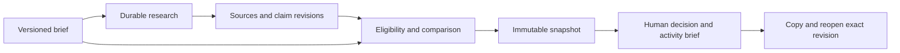

# Growth Atlas

**Research developer events. Understand the evidence. Decide what to explore next.**

Growth Atlas helps growth, go-to-market and developer relations teams investigate events before committing time or participation budget. Starting with a company brief, it connects public sources, organizer history and event details to an explainable comparison—and saves the team's decision together with its evidence and open questions.

This repository contains the working **San Francisco research-to-decision prototype**, developed as GrowthX and documented for a Puentes engineering review. Some interface and package names still use GrowthX or GrowXth.

**[Watch the quick demo on Loom](https://www.loom.com/share/c92423774f7847368838580346519133)**

[Product and discovery](docs/product.md) · [Architecture](docs/architecture.md) · [Run locally](docs/local-development.md) · [Verification](docs/verification.md) · [Known limitations](docs/known-limitations.md)


*Recorded local demo using real public-source research, September 2026. An approximate public address can produce a map point; a city-only or private venue does not. These saved editions are dated examples, not a current event feed.*

## Why I built it

Conversations with growth and GTM teams surfaced a recurring decision: where should a company participate to reach the right developers, and what evidence makes that opportunity worth exploring? Teams piece together event pages, organizer relationships, past editions and incomplete commercial information. An impressive sponsor list does not establish audience fit, and a free ticket does not establish the cost of a useful activity.

I wanted to make that research easier to inspect and act on. The repository preserves [a documented discovery interview](docs/research/discovery-terac-2026-09.md), the product decisions that followed, and the implementation evidence. The interview is qualitative input; this prototype does not yet establish market size, willingness to pay or improved growth outcomes.

What I am most proud of is taking a problem explored through company interviews in Silicon Valley and turning it into a working, testable proposal. Finding and understanding the problem matters to me as much as building the software.

## What you can do

| Step | What the application provides |
| --- | --- |
| **Define a brief** | Describe the product, audience, topics, dates, budget, constraints and success criteria. Goals include adoption, technical feedback, hiring and awareness. |
| **Research sources** | Run bounded discovery, inspect proposed pages and request deeper reading of supported organizer and project sources. Progress and partial failures persist. |
| **Inspect background** | Follow dated source excerpts, previous editions, organizer roles and documented company participation. Announcements and reported outcomes remain distinct. |
| **Explore events** | Move between the list, SF street map and evidence dossier. Locations retain their declared precision and uncertainty. |
| **Compare editions** | Compare up to three options against a versioned brief. See relevant evidence, exclusions, incomplete costs and questions under “What to investigate first.” |
| **Record a decision** | Explore first, choose, discard or leave pending. Record reasons and, where applicable, an activity proposal, owner, conditions and costs. |
| **Copy and reopen** | Copy a manual brief or inquiry draft. Reopen an exact saved revision with the evidence available when it was evaluated. |

A useful result can be **“investigate this first, and ask these questions.”** The system does not need to manufacture certainty to support a next step. Saving a decision does not contact an organizer, reserve participation or spend the buyer's budget.

## A concrete example

**DataBridge is a fictional data-tool company**, used to demonstrate a buyer's workflow. It wants developers to connect APIs, databases and spreadsheets to real projects, with a USD 15,000 participation budget and a technical-feedback goal.

Its success definition is to help ten developers connect a source and collect feedback from five. Those are proposed targets, not achieved results. The team investigates whether participants will build relevant projects, whether a hands-on session is permitted, and what participation will cost. A saved **Explore first** decision can preserve those questions and a proposed workshop without claiming the organizer has offered one.

The short [narration and click script](DemoPuentes/demo-script.md) and the [DataBridge script in Word](DemoPuentes/DataBridge-demo-script.docx) support a walkthrough. The Markdown script uses the earlier agent-observability example; the Word version uses DataBridge. Their saved links require the original local database and session. A fresh installation starts with its own research, and can produce different or insufficient results.

## What the real research established

The retained case studied **AI Tinkerers**, **Vultr's documented sponsorship background**, and **AI Security Hackathon / Hackathons.team**. Public pages supplied different kinds of evidence: announced technical programs, previous editions, company roles and an address suitable for approximate geocoding.

Those differences matter. Vultr's historical sponsorship does not make it the organizer of a San Francisco event. An announced technical program is evidence of intended content, not measured attendance or successful adoption. A team's proposed workshop is not a confirmed commercial offer.

The [case and sources](DemoPuentes/evidence/dp-01-caso-y-fuentes.md), [claim register](DemoPuentes/evidence/dp-01-afirmaciones.md) and [real-run evidence](DemoPuentes/evidence/DP-11/README.md) make that reasoning inspectable. Some organizer pages returned HTTP 403, and some discovered domains are outside the current reader's allowlist. Project coverage is incomplete. No live Apify Actor was needed in the retained reference sample; its fallback and recovery paths were tested with controlled responses.

**Dates matter:** the recorded September 12 and 13, 2026 editions are past as of this documentation review on **September 14, 2026**. The September 26 Agent Arena edition was future at this review date, but this documentation does not confirm current availability or participation terms. Historical comparisons remain useful evidence of the workflow; they are not a promise of today's opportunities.

## Engineering decisions worth reviewing

The application uses **Next.js 16, React 19 and TypeScript**, with **PostgreSQL 17**, **pg-boss** and a separate Node worker. MapLibre renders the SF street map. Exa supports source discovery; an optional Apify reader and optional Gemini narrative step have explicit boundaries.



Four decisions carry much of the engineering work:

- **Evidence has identity and history.** Sources, claims, editions and decisions are versioned. An old comparison keeps its pinned evidence when the catalog changes.
- **Accepted work must survive the request.** Run creation and queue acceptance share a database transaction. The worker resumes persisted steps. An uncertain external request is not blindly retried as though it never happened.
- **The model has limited authority.** The official comparison snapshot exists before optional model output. The model can select admitted claims; it cannot invent eligibility, change the decision or authorize spending. Without an approved commercial scoring policy, the application provides factual research priorities rather than a fabricated ROI ranking.
- **Uncertainty remains visible.** Unknown costs stay unknown, previous editions stay historical, and withheld locations stay off the map. Tenant-scoped sessions, row-level security and revision conflicts protect saved work within the implemented model.

Read [Architecture](docs/architecture.md) for tradeoffs and source links. Good starting points in the code are [run acceptance](frontend/lib/server/evaluations/service.ts), [comparison snapshots](frontend/lib/server/evaluations/snapshot-store.ts), [durable discovery](frontend/lib/server/discovery/durable.ts), and [decision persistence](frontend/lib/server/decisions/store.ts).

## Run it locally

The complete [local development guide](docs/local-development.md) covers PostgreSQL, migrations, a development session, provider configuration and the separate worker. The checks recorded here used Node **25** and pnpm; the repository executes TypeScript tests directly with Node.

```bash
git clone https://github.com/Julian0444/GrowthX-for-hackaton.git
cd GrowthX-for-hackaton/frontend
pnpm install --frozen-lockfile
```

After following the guide's database and session setup, run these in two terminals:

```bash
pnpm dev
```

```bash
pnpm worker:dev
```

Open [localhost:3000](http://localhost:3000/). A fresh database contains no preloaded research. Live discovery requires a server-side Exa key; missing credentials or unreadable pages produce explicit limited coverage, not a hidden synthetic dataset. The guide also explains how to review the UI and run controlled tests without paid provider calls.

## Verification and current status

**Working local prototype; final demo acceptance remains open.** DP-01 through DP-11 retain their dated implementation closures. DP-12 is in progress; it is not marked verified, and the final video has not been reviewed.

The September 14 review checked the application code at **`8b0fba1`** in an isolated copy. It reused current passing checks after matching 293 source files, then exercised additional database and browser paths:

| Check | Observed result |
| --- | --- |
| Production build / TypeScript and ESLint | Passed |
| Acceptance, contract, connector and UI tests | 167 passed, no failures or skips |
| Decision and snapshot integration tests with PostgreSQL | 25 test results passed, no failures or skips |
| Research experience in production Chrome | Six scenarios passed, including desktop and mobile |
| Street map in production Chrome | Nine scenarios passed |
| Decision browser journey | Saved, copied, reopened and checked revision conflicts; later failed when a fixed September 12 fixture was correctly excluded as past |

The last row is **a failing end-to-end test**, not a complete pass. The remainder of that scenario was not reached. [Verification](docs/verification.md) links commands, logs and the explanation; [the audit record](docs/evidence/2026-09-14/README.md) distinguishes real browser/database checks from controlled source responses and earlier live research. This documentation pass made no new paid provider calls and did not migrate or reseed the user's local application database.

Known issues include incomplete source coverage, remaining Spanish system text, cost-editor edge cases, a claim-extraction/comparison mismatch, map/list revision inconsistency and annual-event identity handling. These are documented with code references in [Known limitations](docs/known-limitations.md). There is no claim of production readiness, complete English localization, customer adoption or measured commercial return.

## Documentation map

| Document | Purpose |
| --- | --- |
| [Product](docs/product.md) | Buyer problem, discovery evidence, examples and scope |
| [Architecture](docs/architecture.md) | Runtime, contracts, worker, evidence, security boundaries and tradeoffs |
| [Local development](docs/local-development.md) | Reproducible setup, sessions, providers, tests and troubleshooting |
| [Verification](docs/verification.md) | Current checks, historical evidence and what each establishes |
| [Known limitations](docs/known-limitations.md) | Concrete defects, coverage limits and remaining work |
| [DemoPuentes index](DemoPuentes/README.md) | Product specification, implementation tickets, scripts and retained evidence |
| [Product definition](DemoPuentes/finalProduct.md) / [Specification](DemoPuentes/spec.md) | Intended product and acceptance requirements; broader than completed implementation |
| [Implementation plan](DemoPuentes/implementation-plan.md) / [Handoff](DemoPuentes/PuentesHandoff.md) | Milestone status, dependency history and continuation context |
| [Architecture decision record](docs/adr/0001-arquitectura-agente-growth-atlas.md) | Earlier directions and subsequent amendments |

The new reviewer documentation is in English. Historical research and execution notes retain their original Spanish. Screenshots, logs and fixture tests are evidence artifacts, not a licensed event dataset or commercial offers.

## What comes next

First, correct the documented defects and finish the dated acceptance/video review. Then broaden reliable source reading, test the workflow with growth and DevRel teams, and measure whether it reduces research effort while preserving defensible decisions. Willingness to pay and the value of repeated use still need validation.

Outcome tracking, learned commercial recommendations, CRM integrations and automated outreach are future directions. They are not described here as shipped features.

## Build process

I used AI coding tools to help turn discovery and product decisions into implementation, tests and documentation. The repository preserves specifications, execution notes, source-backed findings and failures so reviewers can inspect the work beyond the interface. The engineering review includes incomplete coverage and defects found after earlier green suites.
