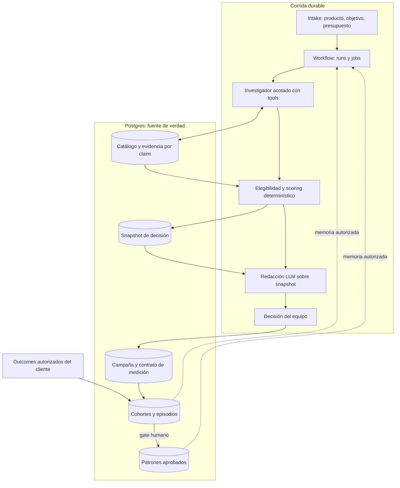

# ADR 0001 — Arquitectura del agente de Growth Atlas

Fecha: 2026-09-04 · Estado: aceptada · Decisores: Julian, Miranda

## Contexto

El pipeline actual (`searchOrFixture` → señales globales → ranking → Exa → Gemini) es una corrida sin estado: no persiste decisiones, campañas ni outcomes, y por lo tanto no puede aprender. La tesis del pitch (Word + deck FC Build) declara que el moat es el historial `empresa + producto + ciudad + evento + gasto → activación + retención`, no el buscador. La investigación completa está en [docs/research/growth-atlas-agent-architecture.md](../research/growth-atlas-agent-architecture.md), que auditó el código, evaluó alternativas (workflow determinístico / single-agent / multiagente) y propuso un diseño.

## Decisión

Adoptamos la arquitectura recomendada por esa investigación:

**Workflow persistente y determinístico que contiene un único agente de investigación acotado**, sobre un monolito modular TypeScript: Next.js (UI + API), un worker Node separado, **PostgreSQL como única fuente de verdad** y **pg-boss** para jobs durables. API de modelo directa con adaptador propio (Gemini hoy, comparables Claude/OpenAI después); sin framework de agentes ni pgvector ni multiagente hasta que un experimento los justifique (§16 y §19 de la investigación).

Principios no negociables:

1. **El LLM no tiene autoridad sobre el ranking.** Interpreta el intake, investiga vacíos dentro de un presupuesto, propone observaciones y redacta sobre el snapshot oficial. El orden lo produce un scorer determinístico con política versionada. Se elimina el `rank` de Gemini y el fallback de citas que conserva narrativa sin soporte.
2. **Exploración de mercados ≠ evaluación de inversión.** Una señal de país se conserva como país; una ciudad sin evento elegible es hipótesis, no recomendación. La unidad recomendada es el **plan de inversión** (cliente + producto + objetivo + evento + mercado + modalidad + fechas + costo completo + plan de medición), con abstención posible.
3. **Evidencia por claim, con revisiones.** Cada valor material lleva fuente, fecha, método, derechos y estado. La elegibilidad (fecha vigente, costo, acceso) precede al score. `S_known` se muestra junto a cobertura `Q` y sensibilidad; sin certeza fingida.
4. **El loop de outcomes es el producto.** Contrato de medición acordado con el cliente (N, A, A_mature, R30, K), ingesta deduplicada (CSV mínimo al inicio), cohortes por madurez, episodios persistentes y **gate humano** antes de promover cualquier patrón. Los agregados exactos se publican por reglas; las generalizaciones requieren revisión (caso Terac: episodio sí, sesgo del organizador no).
5. **Conectores intercambiables detrás de adaptadores.** Exa se conserva como discovery; Apify solo con Actors en allowlist; X fuera del score del piloto. Ninguna fuente externa es instrucción.

## Alcance v1 (vertical slice, §17 de la investigación)

Un cliente, un producto, dos mercados (SF + NYC), hasta tres eventos futuros verificados, una campaña medida; el objetivo del piloto y su métrica los fija la compra real del design partner (ver enmienda v1.1 — la entrevista con Terac apunta a recruiting antes que adopción). Simplificaciones aceptadas: JSONB validado para perfil/campaña/snapshot, un tenant real + un tenant señuelo en tests, outcomes por CSV, sin ejecutor externo (el equipo ejecuta la campaña por su proceso), UI actual leyendo reportes persistidos, mapa como vista del snapshot.

**Criterio de aceptación del mecanismo:** una segunda consulta recupera el episodio correcto de forma trazable, la decisión original se reproduce desde el snapshot, un reinicio del worker no pierde el run y los dos tenants no se cruzan.

## Orden de construcción (§18.3, comprimido)

1. Congelar v0 como baseline y convertir los defectos conocidos en criterios de aceptación (presupuesto fuera de la clave de cache, geografía país≠ciudad, fechas vencidas, citas sin soporte, autoridad de rank).
2. Contratos + Postgres + workflow durable en un recorrido estrecho; la UI lee reportes persistidos.
3. Catálogo de eventos futuros verificados y scoring v1 (con v0 en shadow).
4. Cerrar el loop: campaña → ingesta CSV → cohortes → episodio → siguiente decisión.

El investigador adaptativo se mide contra el workflow fijo antes de quedarse (§16); multiagente, pgvector y elección definitiva de modelo quedan detrás de experimentos (§19).

## Consecuencias

- Dejamos de vender "buscador": el buscador es una tool. El entregable es una decisión ejecutable, medible y que mejora con cada campaña.
- Costo inicial: montar Postgres + worker + contratos antes de features visibles. Lo aceptamos porque sin persistencia no existe el moat declarado.
- Los 136 eventos seed pasan a ser fixtures históricos con fecha congelada; recomendar inversión exige fuentes refrescadas.

## Enmienda v1.1 (2026-09-04, revisión cruzada con Codex)

La arquitectura y el diagrama no cambian. Se ajusta el alcance del slice y se agregan tres capacidades a los contratos existentes:

1. **El objetivo del piloto lo fija una compra real del design partner, no la tesis.** La entrevista con Terac reporta valor en recruiting y enterprise deals; nuestra tesis de adopción/retención necesita un cliente que realmente busque adopción. Si Terac compra recruiting, el piloto mide costo por contratación (bonus: se mide sin integrar telemetría de producto — el cliente sabe a quién contrató — así el loop cierra más rápido). La métrica de adopción sigue siendo el norte para clientes devtools; lo que el slice valida es el *mecanismo* decidir→ejecutar→medir→aprender con el outcome que el partner pague.
2. **Decisión condicional como salida de primera clase** (en Snapshot/Reporte): "recomendado si se confirma este acceso, esta audiencia y este costo", con las preguntas pendientes al organizador y qué respuesta cambiaría la decisión.
3. **Registro de compromisos por campaña** (en Campaña y medición): separar estimación / objetivo / compromiso acordado, con quién confirma, fecha límite y cómo se verifica. El organizador puede confirmar una ficha (evidencia autenticada) sin construir todavía el producto lado B — versión mínima del caso de uso 12 desde el piloto.
4. **Motivos de elección y descarte** (en Episodios): por qué se eligió o descartó cada alternativa (calendario, condiciones, staffing). Un descarte no es una campaña fallida: su resultado nunca se observó.

Prioridad de casos de uso acordada: núcleo = dossier, expediente del organizador y comparación (2, 3, 7); mismo recorrido = campaña→medición→memoria (8–11); apoyo = descubrimiento sobre catálogo curado, radar y ledger mínimo (1, 4, 12); después = camino cálido, perfil verificado y matchmaking (5, 13, 14 — el camino cálido solo se promete con conexiones confirmadas); experimentos = buzz (6, 15 — no influyen decisiones hasta validarse).

Correcciones de lenguaje adoptadas: "cada evento medido aporta evidencia para evaluar y mejorar las próximas decisiones" (la mejora se comprueba, no se asume); el perfil del organizador muestra afirmaciones verificadas con su alcance, no un puntaje único; "validado" en discovery significa dolor reportado en entrevista — falta probar uso y disposición a pagar.

## Enmienda v1.2 — investigación de organizadores en San Francisco (2026-09-07)

**Origen:** dirección de producto solicitada por Julian después de nuevas conversaciones con equipos de growth. El foco está solicitado; el producto detallado y los tickets siguen pendientes de revisión humana y cruzada. Esta enmienda no autoriza implementación. El relato adicional de conversaciones no se agrega a la entrevista de Terac como si perteneciera a esa fuente.

La entrada principal pasa a ser un **dashboard de investigación y decisiones para patrocinios en San Francisco**, con navegación lateral izquierda. Desde el perfil de empresa, audiencia, objetivo y presupuesto, el equipo descubre organizadores pertinentes dentro de la cobertura disponible, investiga sus antecedentes, abre sus eventos y compara alternativas concretas. El mapa queda como vista secundaria del buscador de eventos de SF. Esto reemplaza el requisito anterior de conservar el mapa global como pantalla principal y el alcance inicial SF + NYC; se reutilizan los componentes útiles de dossier, fuentes e importación, sin mantener aquella navegación como restricción.

El primer slice conserva el nombre **evaluación persistida** y amplía su entrada: perfil → organizadores con antecedentes pertinentes → dossier de organizador/evento → decisión condicional guardada → reabrir. También debe funcionar pegar directamente una URL de Luma. El conjunto inicial sigue siendo manual y pequeño: 2–5 eventos futuros en SF, con sus organizadores y antecedentes documentados disponibles. No se promete un directorio exhaustivo ni «los mejores de SF» a partir de ese conjunto.

Organizador, edición de evento y empresa participante son entidades distintas. Cada relación identifica rol —organiza, patrocina, presenta, aloja u otro explícito— y fuente. Ver una empresa competidora en una edición respalda únicamente esa relación documentada. No demuestra inversión, exclusividad, repetición deliberada, asistencia ni retorno. El perfil que aporta el cliente puede nombrar competidores o empresas comparables; una similitud propuesta queda por confirmar.

«Éxito» se descompone en lo que se anunció, lo que hay evidencia que ocurrió y el resultado que una empresa obtuvo para un objetivo definido. Proyectos publicados, asistentes reportados o sponsors repetidos son antecedentes con límites. Un resultado comercial sin fuente queda desconocido. No se publica un score universal de confianza del organizador ni se deducen resultados privados.

Se añade investigación manual de antecedentes de organizadores y de empresas vinculadas, como evidencia del dossier. Esto **no habilita** radar automático de sponsors, scraping nuevo, social graph o ingesta de outcomes/CSV. El nombre de producto «radar de decisión» describe la lista de investigaciones, vacíos y decisiones, no un monitor que recolecta señales automáticamente.

Se mantienen TypeScript modular, Next.js + worker Node, PostgreSQL, pg-boss, API de modelo directa, elegibilidad antes que scoring, autoridad determinística del ranking, evidencia por claim y aislamiento de tenants. Los cinco defectos de v0 siguen encabezando los tickets; el baseline se conserva para regresión, no para imponer un ranking mundial en el producto nuevo.

**Criterio del slice actualizado:** ambos caminos —perfil → organizadores y URL Luma → dossier— llegan a una decisión guardada y reabrible; el recorrido principal funciona sin abrir el mapa. Reiniciar el worker no pierde el run, una segunda consulta conserva la trazabilidad y los dos tenants no se cruzan. La calidad comercial se prueba haciendo que un comprador evalúe una decisión real; ni el nuevo foco ni una demo acreditan todavía disposición a pagar.

El [producto de destino](../../plan/finalProduct.md) y el [plan consolidado](../../plan/implementation-plan.md) desarrollan esta dirección. El resultado principal del slice es evidencia utilizable **antes de comprometer presupuesto**. Medición y aprendizaje posterior permanecen como horizonte separado, fuera de estos tickets.
