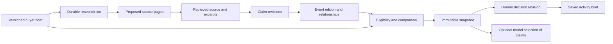

# Architecture

Growth Atlas is a modular TypeScript application with a Next.js interface/API and a separate Node worker. PostgreSQL stores research, evidence, comparisons, decisions and durable work. The architecture favors a traceable workflow over an agent that can make unrestricted commercial decisions.

This document describes the current implementation. The [original ADR and its amendments](adr/0001-arquitectura-agente-growth-atlas.md) preserve the reasoning and earlier directions; the initial global-market and post-event learning-loop diagrams are broader than today's shipped SF workflow. See [Product](product.md), [Local development](local-development.md) and [Verification](verification.md) for scope, setup and observed results.

## Runtime and boundaries

The [package manifest](../frontend/package.json) specifies Next.js **16.2.6**, React **19**, TypeScript **5.7.3**, `pg` **8**, `pg-boss` **12**, MapLibre GL **6.9.0** and `parse5` **8**. PostgreSQL **17** is the development/test database. The lockfile records resolved dependency versions.

| Boundary | Responsibility | Entry point |
|---|---|---|
| Browser | Brief, research progress, dossiers, map/list, comparison and decision editor | [Dashboard](../frontend/components/research-dashboard/research-dashboard.tsx) |
| Next routes | Resolve session, validate input, accept jobs and read persisted results | [API routes](../frontend/app/api/) |
| Application service | Profile/run identity, idempotency and transactional job acceptance | [Evaluation service](../frontend/lib/server/evaluations/service.ts) |
| Worker | Execute and resume persisted steps using the run's tenant context | [Worker](../frontend/worker/index.ts), [step dispatcher](../frontend/lib/server/evaluations/run-worker.ts) |
| PostgreSQL | Source of truth, revision chains, run state, provider allowance and queue | [Migrations](../frontend/db/migrations/) |

The worker continues independently of the browser and Next request lifetime. Reopening reads stored progress. The tradeoff is operating a database and worker alongside the frontend.

## Data and authority

[Shared contracts](../frontend/lib/contracts/evaluation.ts) and [runtime parsers](../frontend/lib/contracts/evaluation-validation.ts) define the boundary between these stages. Typed JSONB payloads are validated on writes and important read paths; a TypeScript annotation alone is not accepted as persisted-data validation.

A source records origin, retrieval time/method and excerpts or content identity. Claims bind a specific attribute/value/state to supporting source references. Event editions keep their own revision, dates, location and relationships; a recurring event name is not sufficient evidence that two editions are equivalent. Sources and relationship references are resolved under the tenant when persisted.

A comparison fixes a profile version, evaluation instant, edition revisions, claim revisions and supporting sources in an [official snapshot](../frontend/lib/server/evaluations/snapshot-store.ts). Its record is inserted once per run. Reopening reads the pinned evidence rather than substituting the latest catalog revision. New evidence or a changed brief requires a new evaluation; it does not rewrite the earlier decision context.

Revisioned JSONB supports additive contracts and older records, at the cost of explicit validation. Immutable history also requires future retention and backup planning.

## Durable acceptance and recovery

[Run acceptance](../frontend/lib/server/evaluations/service.ts) writes the profile, run, steps and pg-boss job in one transaction. The [queue adapter](../frontend/lib/server/evaluations/queue.ts) supplies that transaction's database client to pg-boss. A failed enqueue rolls back acceptance instead of returning success for unqueued work.

Idempotency is scoped to tenant and request key: the same payload returns its run; a different payload conflicts. The worker skips completed steps on recovery. Provider and catalog operations use persisted identities and advisory locks to coordinate work.

Database recovery does not imply exactly-once execution by an external provider. [Exa discovery](../frontend/lib/server/discovery/durable.ts) records dispatch before sending. If a crash loses the response, the operation becomes uncertain, its reservation remains and it is not automatically resent. Persisted deadlines also prevent a restart from extending the research window indefinitely.

## Source acquisition and budgets

The [discovery planner](../frontend/lib/research/discovery-plan.ts) derives opportunity, background and participation-condition queries from the brief. Current maximums are three queries, five results per query, 12 seconds per request and 45 seconds per discovery run. Results remain proposed pages until read; search snippets are not admissible claim evidence.

The [native reader](../frontend/lib/server/sources/reader.ts) admits known HTTPS hosts, validates redirects, caps bodies at 2 MB and shares a timeout across redirects/body reading. `parse5` extracts visible text and JSON-LD without executing JavaScript. A [persistent cache](../frontend/lib/server/sources/cache.ts) labels failed-refresh fallbacks. Unsupported domains and some rendered content remain unreadable.

The [optional Apify adapter](../frontend/lib/server/sources/website-crawler.ts) requires an explicit content gap and resumes polling its persisted Actor ID. Retained recovery tests use controlled responses; the reference sample did not require a live Actor. A token alone does not enable an automatic fallback.

Provider allowances are separate from the buyer's participation budget. [Exa](../frontend/db/migrations/007-discovery-exa.sql) reserves USD 0.02 per attempt against an installation-wide USD 10 allowance; [Apify](../frontend/db/migrations/008-source-reading.sql) reserves USD 1 against USD 15. Unknown costs retain their reservation. These are conservative local controls, not account balances or final invoices.

## Comparison and model limits

[Eligibility](../frontend/lib/server/evaluations/eligibility.ts) evaluates dates and constraints before scoring. Known cumulative costs can exclude an option; incomplete, inferred or incomparable costs remain explicit conditions. A past edition can remain useful background without becoming a future opportunity.

[The scoring-policy provider](../frontend/lib/server/evaluations/scoring-policy.ts) currently returns no approved commercial policy. The deployed workflow therefore offers factual comparison and a supported research priority, not an investment ranking based on unapproved test weights.

The [Gemini adapter](../frontend/lib/server/evaluations/model-adapter.ts) runs after the official snapshot is saved. It can select admitted claim revisions; it cannot change eligibility, conditions, order or scores. Free model wording is not published as a fact: the server composes permitted attributes, values and statuses. Invalid references reject the output; missing configuration or failure preserves a deterministic result. Narrative status and available token usage are stored separately from the snapshot.

## Tenant and decision integrity

[Session resolution](../frontend/lib/server/auth/session.ts) hashes an opaque cookie/Bearer token and checks its membership and expiry in PostgreSQL. The server derives tenant/user identity; clients cannot choose a tenant merely by passing its ID. [Tenant transactions](../frontend/lib/server/db/pool.ts) set local database context, and business tables use row-level security.

`growthx_app` serves requests and resolves sessions; `growthx_worker` handles business work under RLS; `growthx_queue` administers pg-boss without business-table grants. Administrative migration credentials are separate. The current opaque-session mechanism supports the local prototype and isolation tests; it is not a complete public SaaS onboarding, identity-provider or authorization administration product.

[Decision saving](../frontend/lib/server/decisions/store.ts) records a human judgment against a snapshot. Decision and applicable campaign draft commit together. Updates append a revision with an expected revision number; stale edits conflict. Unresolved snapshot conditions remain open, and a confirmed exclusion cannot be overridden by choosing an option. “Explore first” is stored as pending participation with an explicit research intent. Copying a brief or recording a question sends no external message.

## Location and presentation

[Location policy](../frontend/lib/research/location-policy.ts) and [position projection](../frontend/lib/research/edition-location.ts) distinguish public coordinates, resolved addresses, city-only records and conflicts. The optional [Census adapter](../frontend/lib/server/geocoding/census.ts) checks the returned address and SF county; it labels interpolation as approximate rather than implying rooftop accuracy. A new location revision preserves prior snapshots.

MapLibre renders the street map while list, marker and dossier share edition identity. Missing map assets or coordinates do not remove the underlying evidence from the list. English presentation includes [compatibility rules](../frontend/lib/research/english.ts) for known older system messages; original source excerpts and buyer input are preserved.

One known identity gap remains: [native Luma ingestion](../frontend/lib/server/catalog/luma-adapter.ts) matches existing editions by canonical URL without also checking the year. A URL reused annually can therefore retain the same edition identity. The intended edition boundary needs further hardening; do not infer universal correctness from the model above.

See [Verification](verification.md) for current regressions and checks. Production rollout, broader extraction, outcome measurement and learned recommendations remain separate work.
