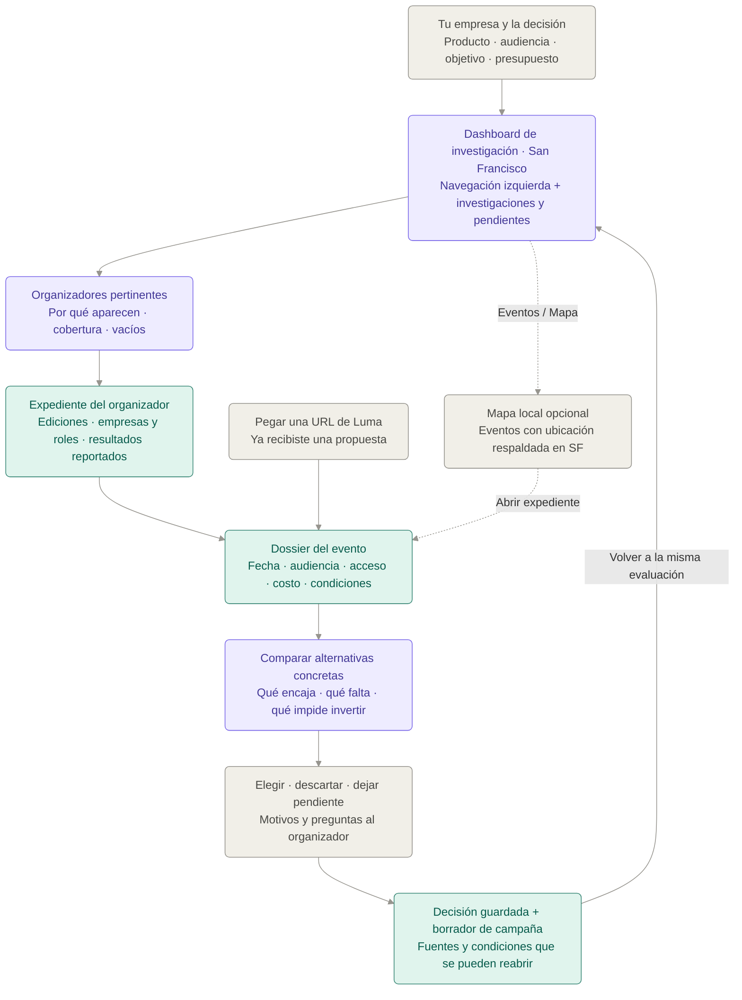

# Growth Atlas — investigar organizadores y decidir patrocinios en San Francisco

7 de septiembre de 2026 · Documento de destino revisado por la dirección solicitada por Julian. Producto y tickets pendientes de revisión; esta descripción no significa que la UI ya esté implementada.

## Qué es y qué problema resuelve

**Growth Atlas es un motor de investigación y decisiones para equipos de growth que necesitan encontrar organizadores pertinentes en San Francisco y evaluar sus eventos antes de comprometer presupuesto.**

El responsable de growth necesita llegar a una audiencia específica, pero conoce pocos organizadores y la información que encuentra está dispersa. Una página anuncia un evento; otra muestra sponsors; un recap cuenta lo que pasó. Sigue sin poder responder con claridad quién lo organizó, si trabajó con productos como el suyo, qué audiencia reunió y qué evidencia existe de resultados.

La app reúne esa investigación alrededor de la empresa del comprador. Su salida es una lista razonada de organizadores dentro de la cobertura disponible, sus antecedentes documentados, eventos concretos por evaluar y una decisión que distingue hechos, estimaciones y condiciones pendientes.

No prometemos «toda la información posible» como si fuera alcanzable. Buscamos **la información material para decidir y la explicación de qué falta**. Una ficha muy completa sobre speakers puede seguir siendo insuficiente para pagar un patrocinio si no conocemos audiencia, acceso o costo.

## Por qué cambia el foco y qué sabemos

**Reportado en discovery Terac:** el responsable revisa manualmente trayectoria, asistencia y audiencia antes de patrocinar; las notas recogen diferencias entre expectativas y resultados, dificultades de contacto y acuerdos dispersos. Es una entrevista, no una prueba de disposición a pagar. Las observaciones 150→60 y 50%→25% no se tratan como dos pruebas independientes ni como reputación de un organizador. [Registro de Terac](../docs/research/discovery-terac-2026-09.md).

**Reportado por Julian el 7 de septiembre:** nuevas conversaciones con equipos de growth señalan dificultad para encontrar organizadores y conocer sus antecedentes y éxito. Aquí no tenemos el número de entrevistas, transcripciones ni eventos identificados; no los inventamos ni los atribuimos a Terac.

**Contenido del deck aportado:** la diapositiva 5 coloca la decisión antes del evento; la 7 declara conversaciones de discovery y la 9 describe el MVP de SF/NYC. Son el relato del pitch, no verificación independiente de esas conversaciones ni de vigencia de los 136 eventos. No necesitamos sus estadísticas de mercado para justificar este corte. [GrowthX FC Build 2026 (1), texto y notas revisados](</Users/jirustaroure/Downloads/GrowthX FC Build 2026 (1).pptx>).

**Dirección solicitada:** profundizar SF, poner organizadores e investigación en primer plano y hacer secundario el mapa. La [enmienda v1.2 del ADR](../docs/adr/0001-arquitectura-agente-growth-atlas.md) registra el cambio de producto sin reabrir la arquitectura técnica.

**Hipótesis por comprobar:** que una investigación así aporte datos o preguntas que cambien una decisión real y ahorre trabajo que hoy el comprador hace manualmente. Un dashboard más atractivo, por sí solo, no demuestra ese valor.

## Qué aprovechamos del repo y qué cambia

Hoy la aplicación entra por el atlas mundial, una descripción del producto y objetivos. Ya existen panel de oportunidad, fuentes, importación por URL de Luma y una vista de campaña con mensaje copiable. El presupuesto enviado desde la UI es cero, el importador no persiste el dossier y el store de decisiones utiliza memoria de proceso. No existe el dashboard ni el expediente de organizador que se describe aquí.

Reutilizamos el importador, componentes de evidencia, elementos del panel y la campaña. **La navegación de destino cambia a dashboard → organizador → evento → comparación → decisión guardada.** Quien ya tiene una URL puede entrar directamente al evento. El mapa se limita a eventos de SF y se abre cuando ayuda a entender ubicación; no se necesita para investigar ni decidir.

SF es el ámbito inicial. Una organización puede tener antecedentes fuera de SF, debidamente localizados, pero eso no convierte esos eventos en oportunidades locales. No asumimos que «Bay Area», San José o una localización de país equivalgan a San Francisco. El catálogo pequeño tampoco autoriza decir «los mejores organizadores de SF».

## La app de un vistazo

El diagrama usa bloques beige para acciones del equipo, violeta para investigación/comparación y verde para evidencia y decisiones conservadas. Los colores no certifican un dato. La línea punteada conduce a una vista opcional.

## El paseo por la app

### 1. Abre un espacio de investigación

A la izquierda ve **Resumen, Organizadores, Eventos y Decisiones**; el perfil de su empresa queda accesible al pie. La zona central muestra investigaciones abiertas, condiciones pendientes y decisiones recientes. Si todavía no hay datos, ve el formulario de empresa y una explicación de la cobertura disponible, no métricas de muestra que parezcan reales.

La persona describe qué vende, a quién quiere llegar y qué espera conseguir. Añade stack, presupuesto y fechas. Puede indicar empresas comparables o competidoras que ya conoce; la app no deduce una rivalidad comercial solo porque dos productos mencionen IA. Revisa la interpretación antes de investigar.

Un ejemplo ilustrativo sería una herramienta para equipos que construyen agentes y una audiencia de ingenieros con experiencia en producción. No impone adopción ni recruiting como objetivo del cliente. La ubicación está fijada a SF; no hay un paso para elegir «el mejor país».

**DECISIÓN ABIERTA:** comprador del primer piloto, objetivo comprado y definición de éxito. Se puede preparar investigación con un objetivo provisional, marcado como tal.

### 2. Encuentra organizadores con antecedentes pertinentes

El dashboard presenta los organizadores cubiertos que tienen antecedentes relacionados con su audiencia, producto o formato. Cada fila muestra el nombre, una razón específica de pertinencia, eventos que la sustentan, fecha de revisión y el principal vacío de información. Puede filtrar por tema, formato, fechas de eventos disponibles y campos verificados.

Una razón admisible sería: «En esta edición hubo proyectos que utilizaron APIs de agentes; abrí la galería vinculada». Decir que todos los participantes eran compradores senior requiere otra evidencia. Sin antecedentes pertinentes, la app dice que su catálogo no alcanza: no completa tres recomendaciones con nombres plausibles.

La persona puede guardar a un organizador para investigar aunque todavía no haya un evento futuro disponible. Eso es una selección de investigación; no es una recomendación de gastar en esa organización.

El primer slice hará este recorrido con los organizadores de 2–5 eventos futuros curados y antecedentes manuales disponibles. La profundidad del expediente debe poder demostrarse antes de aumentar el número de nombres.

### 3. Abre el expediente del organizador

Ve quién organiza y cuál es su relación con cada edición. Distingue organizador, coorganizador, sede, speaker y sponsor. Dos personas con nombres similares no comparten automáticamente historial; pertenecer a la misma serie tampoco convierte una edición en copia de otra.

El expediente reúne una cronología de ediciones, temas, formato, audiencia anunciada, evidencia sobre ejecución y empresas vinculadas. Cada antecedente tiene fuente y fecha. Si una empresa comparable aparece, la ficha muestra **en qué evento y con qué rol**. Un logo sin rol claro queda como mención por verificar.

En «Qué sabemos de los resultados» la pantalla diferencia tres preguntas:

| Pregunta | Evidencia que puede responderla | Qué sigue sin demostrar |
| --- | --- | --- |
| ¿Qué prometieron? | Página y propuesta del organizador, con fecha | Que esa audiencia asistió o se entregó lo prometido |
| ¿Qué ocurrió en el evento? | Recap atribuido, proyectos publicados o registros autorizados con método | Que un sponsor obtuvo clientes o recuperó su inversión |
| ¿Qué consiguió una empresa? | Caso publicado o confirmación autorizada que identifique evento, objetivo, período y resultado | Causalidad exclusiva del evento o que otra empresa repetirá ese resultado |

Si no hay datos comerciales, dice «resultado del patrocinio desconocido». Una segunda participación de un sponsor puede ser pertinente, pero no demuestra por sí sola satisfacción ni ROI. «Exclusivo para este tema» y «exclusividad comercial para el sponsor» son condiciones diferentes.

Al pie ve las preguntas que más cambiarían su decisión: composición de audiencia, posibilidad de actividad, términos de acceso, referencias de sponsors anteriores o costo completo. El expediente no puntúa al organizador como universalmente confiable.

### 4. Pasa a un evento que podría patrocinar

Desde el organizador abre una edición futura en SF. También podría haber pegado una URL de Luma directamente: ambos caminos llegan al mismo dossier.

La pantalla muestra fecha y lugar, quién organiza, público, modalidad de participación, costos y condiciones. Lo anunciado mantiene esa etiqueta; los datos confirmados muestran quién los confirmó y con qué soporte. Si falta costo o acceso, queda pendiente. Los créditos de producto no se suman al efectivo como gasto equivalente.

Desde «Eventos» puede alternar **Lista / Mapa de SF**. El mapa ayuda a ubicar un venue o mirar proximidad, con una lista equivalente para eventos cuya localización aún no se verificó. No hay ranking de ciudades ni animación mundial previa a la investigación.

**DECISIÓN ABIERTA:** eventos y organizadores concretos del piloto, quién verificará sus antecedentes y qué material puede conservarse. Una invitación mencionada en una conversación anterior no se da por futura en septiembre sin revisar su fecha.

### 5. Compara y guarda una decisión

Elige hasta tres alternativas concretas. La comparación conserva el contexto de cada organizador y responde qué audiencia tiene soporte, qué actividad se puede comprar, cuánto se conoce del costo y qué falta confirmar. Una opción vencida o incompatible queda excluida antes de puntuar.

La recomendación puede decir: «Investigar esta opción primero: hay antecedentes de proyectos relevantes, pero falta comprobar el acceso al workshop y el perfil de asistentes». Solo pasa a elección de inversión cuando existe una edición y condiciones concretas; la frase no certifica al organizador.

Si hay una política de scoring aprobada para ese objetivo, la app muestra score, cobertura y sensibilidad juntos. Si no la hay, ofrece comparación factual y condiciones sin inventar un ranking numérico. Afinidad, calidad de evidencia y preferencia del equipo se leen por separado.

La persona elige, descarta o deja pendiente, explica por qué y registra qué respuesta podría cambiar la decisión. Puede elegir condicionalmente. Una alternativa descartada no se convierte en campaña fallida.

**DECISIÓN ABIERTA:** criterios comerciales y política del objetivo del piloto. Ningún ejemplo numérico de prueba decide esos pesos.

### 6. Reabre un expediente que conserva el razonamiento

La elección abre una campaña en borrador con modalidad, costos, preguntas y compromisos. Los acuerdos se distinguen de estimaciones y objetivos; copiar el mensaje permite enviarlo por el canal habitual. Guardar no contrata ni contacta a nadie.

Cierra la app. Al volver a «Decisiones», recupera el mismo evento, expediente del organizador, fuentes y motivos que sustentaban la elección. Una nueva fecha o cotización genera otra evaluación si la solicita; no cambia silenciosamente lo que había aprobado.

Se lleva una decisión interna consultable y una lista concreta de comprobaciones antes de comprometer dinero. Ese es el resultado completo del primer slice.

Después, si un cliente autoriza resultados de sus campañas, el producto podrá vincularlos a esos antecedentes. **Ese seguimiento posterior es una extensión por validar, no una condición para que esta primera investigación aporte valor.** En estos tickets no se implementan CSV, cohortes o aprendizaje.

## Seis casos de uso dentro de esta dirección

| Caso | Quién | Cuándo | Qué obtiene |
| --- | --- | --- | --- |
| Encontrar organizadores pertinentes en SF | Growth de una startup de herramientas para desarrolladores | Tiene audiencia y presupuesto, pero aún no una propuesta | Selección explicada sobre el catálogo cubierto y sus límites |
| Investigar trayectoria de un organizador | Growth o DevRel | Le recomiendan un nombre o recibe una propuesta | Ediciones, roles, audiencia documentada, contradicciones y preguntas |
| Revisar empresas comparables | Responsable de growth | Quiere saber dónde participaron productos semejantes | Empresa→edición→rol con fuente; resultados solo si existen |
| Evaluar un evento recibido | Quien decide el patrocinio | Le llega una URL de Luma | Dossier persistido y campos pendientes, conectado con su organizador |
| Comparar antes de comprometer presupuesto | Responsable del presupuesto | Tiene alternativas concretas | Diferencias materiales, restricciones y decisión condicional |
| Recuperar y actualizar una decisión | Mismo equipo | Vuelve al expediente o recibe condiciones nuevas | Versión original recuperable y nueva evaluación explícita |

## Cómo se lo vendemos a un equipo de growth

La conversación empieza con un organizador o un patrocinio real que el equipo está evaluando. Pedimos que nos muestre qué preguntas necesita responder antes de pagar y reconstruimos el expediente con sus alternativas.

> «Contanos qué vende tu empresa y a quién necesita llegar en SF. Te mostramos qué organizadores de nuestra cobertura tienen antecedentes pertinentes, dónde participaron empresas comparables y qué sabemos realmente de esos eventos. Guardamos la comparación y las condiciones que falta confirmar antes de invertir».

Hoy lo comparan con su red de contactos, páginas de eventos, búsquedas manuales, hojas de cálculo y un asistente que resume páginas. La propuesta tiene que aportar trazabilidad y relaciones que puedan inspeccionar: pasar de una recomendación de organizador a una edición, de esa edición a una empresa y de la empresa al dato concreto disponible. Un párrafo convincente sin esas pruebas no alcanza.

Luma sigue siendo útil como fuente y plataforma de eventos. Nuestra razón para ser una app separada está en el expediente de investigación ligado al contexto del comprador y en la decisión guardada. No suponemos qué funciones ofrecen otros productos sin verificarlas ni prometemos reemplazar el registro o la organización del evento.

Para comprobar valor, observamos una evaluación real: qué pregunta quedó resuelta, cuál cambió su selección o condiciones, qué fuentes abrió y si pudo retomar el trabajo sin investigar otra vez. Medimos tiempo con un inicio y final acordados y una comparación manual equivalente. No inventamos una reducción porcentual.

**DECISIÓN ABIERTA:** si compra investigación por evaluación, acceso recurrente al catálogo u otra modalidad, quién paga y cuánto. La oportunidad de cobrar antes de medir outcomes es una hipótesis a probar.

## Demo de cinco minutos

La demo principal termina antes de gastar. Cada evento y antecedente debe ser real y revisado o estar rotulado como fixture; no se simulan resultados exitosos para hacer convincente el producto.

| Tiempo | Qué mostramos | Qué queda claro |
| --- | --- | --- |
| 0:00–0:40 | Dashboard con navegación izquierda. Completar empresa, audiencia, objetivo provisional/confirmado y presupuesto; SF fijo. | La investigación empieza por la decisión del comprador. |
| 0:40–1:20 | Lista de organizadores y razón documentada de pertinencia. Mostrar cobertura y un vacío. | Los nombres tienen un motivo inspeccionable; no son una lista universal de mejores. |
| 1:20–2:30 | Expediente: edición pasada, empresa comparable y rol. Abrir el soporte y el apartado de resultados conocidos/desconocidos. | Participación y éxito son cosas distintas; ahora sabe qué preguntar. |
| 2:30–3:25 | Abrir la edición futura o pegar URL Luma. Comparar con otra opción, mostrando costo/acceso pendientes. | La trayectoria se conecta con una compra concreta. |
| 3:25–4:15 | Guardar elección condicional, motivo y pregunta material al organizador. Abrir el borrador de campaña. | Puede avanzar sin confundir una incógnita con una confirmación. |
| 4:15–5:00 | Cerrar y reabrir desde Decisiones. Mostrar las mismas fuentes y condiciones. El mapa local solo si queda tiempo. | El trabajo de investigación permanece utilizable por el equipo. |

**El momento central está entre 1:20 y 3:25:** «Este organizador tiene un antecedente pertinente para mi producto; esta fuente respalda esa relación; todavía no sabemos si ese sponsor tuvo retorno; esta es la condición que necesito confirmar antes de pagar». Esa utilidad debe ser visible aunque nunca abra el mapa.

## Qué queda fuera

- Directorio global o comparación de países/ciudades. La cobertura inicial es SF y se declara.
- Una lista exhaustiva de todos los organizadores o de todos sus resultados.
- Una reputación numérica universal, popularidad como señal de retorno o éxito deducido de logos, fotos o cantidad de proyectos.
- Acceso supuesto a listas privadas de asistentes, montos de acuerdos o analytics de otros sponsors.
- Ranking de individuos, reclutamiento de personas o una plataforma de recruiting.
- Ticketing, gestión integral de eventos, pagos, negociación o marketplace de sponsors.
- Mensajes automáticos, reservas o acciones externas de un agente.
- Radar automático de patrocinios, buzz, social graph, intros garantizadas o scraping nuevo en el primer slice.
- Ingesta de resultados/CSV, cohortes y aprendizaje en el primer slice. La app puede citar un resultado histórico autorizado como claim sin implementar ese sistema.
- Cambiar la infraestructura decidida por convertir la entrada en dashboard.

## Base de producto y revisión

El destino se apoya en [ADR 0001 y sus enmiendas](../docs/adr/0001-arquitectura-agente-growth-atlas.md), [casos de uso](../docs/product/casos-de-uso.md), [discovery Terac](../docs/research/discovery-terac-2026-09.md) y el deck enlazado arriba. La [investigación de fuentes para organizadores de SF](../docs/research/fuentes-organizadores-sf-2026-09.md) separa disponibilidad de datos y límites de acceso; que una fuente exista no significa que este repo ya la integre.

Los componentes concretos que se reutilizan están en [atlas-shell](../frontend/components/atlas/atlas-shell.tsx), [panel](../frontend/components/atlas/opportunity-drawer.tsx), [fuentes](../frontend/components/atlas/evidence-links.tsx), [importador](../frontend/components/atlas/event-import.tsx) y [campaña](../frontend/components/atlas/campaign-panel.tsx). El [plan revisado](implementation-plan.md) debe revisarse junto con este documento antes de implementar.
