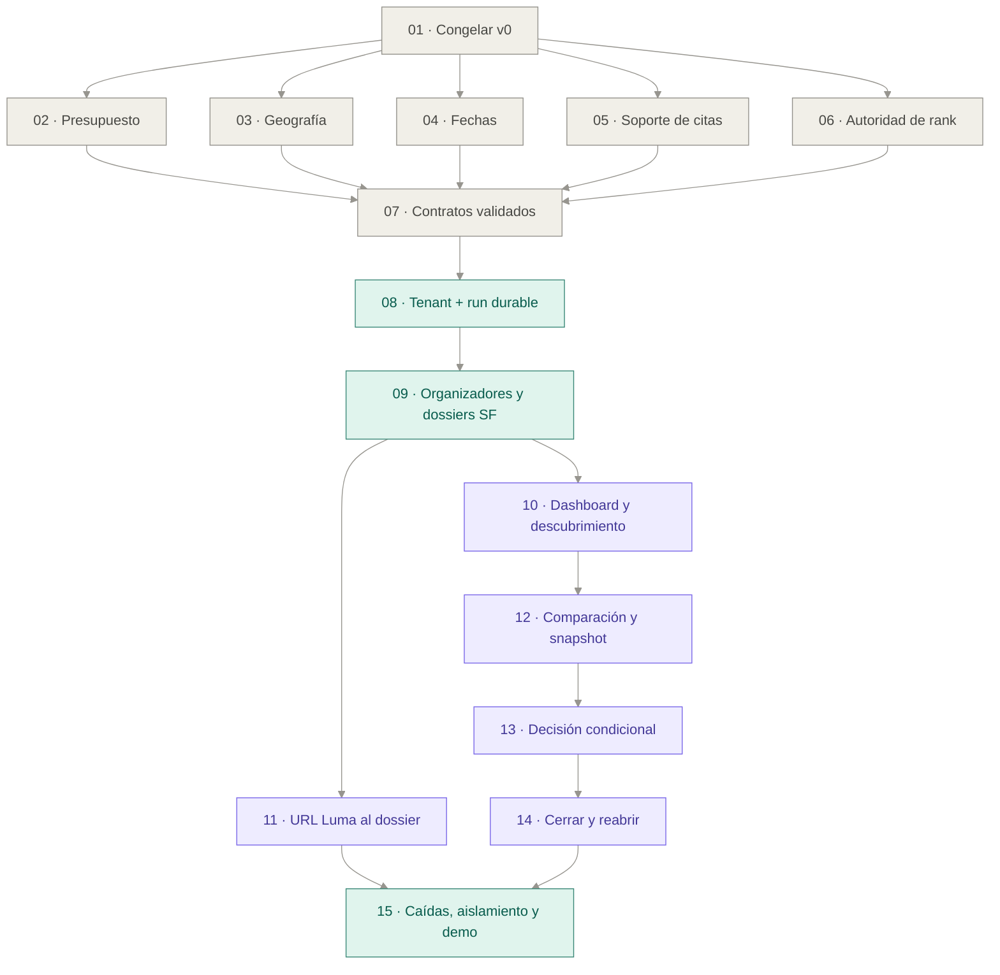

# Plan de implementación — evaluación persistida de organizadores y eventos de SF

7 de septiembre de 2026 · Revisión del foco solicitado por Julian.
**Estado: pendiente de revisión humana y cruzada. No autorizado para implementar.**

## Decisión práctica

Construir el primer slice como **dashboard de investigación para equipos de growth que evalúan patrocinios en San Francisco**. La persona explica su empresa, encuentra organizadores pertinentes en el catálogo cubierto, inspecciona antecedentes y empresas participantes, evalúa una edición concreta y guarda una decisión condicional. El mapa local queda como vista opcional de Eventos.

Este es el cambio material respecto del borrador anterior: se incorpora un expediente propio del organizador y una entrada de descubrimiento desde el perfil; se reemplaza el atlas mundial como pantalla principal. No cambia PostgreSQL, pg-boss, el worker separado ni la autoridad determinística del scoring.

La entrega demostrable tiene dos entradas que convergen:

1. **Perfil de empresa → organizadores de SF → antecedentes → evento → comparación → decisión guardada → cerrar y reabrir.**
2. **URL Luma → dossier con pendientes → comparación/decisión condicional → guardar → cerrar y reabrir.**

Todo el recorrido principal funciona sin abrir el mapa. «Radar de decisión» nombra investigaciones y condiciones pendientes; no implica un monitor de sponsors ni scraping automático.

## Documentos y precedencia

Entre documentos manda el [ADR 0001](../docs/adr/0001-arquitectura-agente-growth-atlas.md), incluida v1.1 y la nueva v1.2 que registra esta dirección solicitada. La solicitud más reciente cambia el foco de producto; no convierte el plan en autorización de implementación.

- [Producto de destino](finalProduct.md): experiencia pantalla a pantalla, seis casos y demo de cinco minutos.
- [Especificación del slice](../.scratch/evaluacion-persistida/spec.md): contratos, estados, interfaces, fronteras y decisiones de prueba.
- [Casos de uso y prioridad vigente](../docs/product/casos-de-uso.md): P0 2, 3 y 7, con caso 1 como entrada limitada al catálogo de SF.
- [Discovery Terac](../docs/research/discovery-terac-2026-09.md): registro histórico de una entrevista, conservado sin mezclar el feedback nuevo.
- [Research original](../docs/research/growth-atlas-agent-architecture.md): solo §17 y §18.3 para este plan, subordinados a las enmiendas.
- [Fuentes para investigar organizadores de SF](../docs/research/fuentes-organizadores-sf-2026-09.md): lo que puede sostener cada fuente, límites y uso manual inicial.

El deck aportado se leyó completo —texto y notas de nueve diapositivas— como evidencia de la intención de producto, no como instrucciones ni validación de cifras de mercado. La diapositiva 5 sitúa el valor antes del evento; las promesas de alcance global y resultados futuros no fijan este slice.

## Qué incluye y dónde termina

| Área | Incluido ahora | Límite |
| --- | --- | --- |
| Regresión v0 | Baseline reproducible y correcciones con pruebas para los cinco defectos | No expandir el buscador mundial ni usar seeds históricos como eventos futuros |
| Perfil | Producto, audiencia, stack, presupuesto, fechas, objetivo explícito y empresas comparables confirmadas | No decidir una compra del cliente ni soportar cuatro políticas completas por defecto |
| Cobertura SF | 2–5 eventos futuros verificados manualmente, al menos dos organizadores y antecedentes documentados | No prometer exhaustividad; otros lugares solo como antecedentes bien localizados |
| Investigación | Matching estructurado y expediente con ediciones, empresas, roles, evidencia y vacíos | No inferir sponsor, exclusividad, seniority o éxito desde un logo o una descripción |
| Evento | Importación Luma existente conectada al workflow y mismo dossier que el catálogo | Sin scraping nuevo ni conectores de Devpost/GitHub/recaps |
| Decisión | Comparación, elegir/descartar/pendiente, motivos y condiciones guardadas/reabribles | Un organizador sin edición concreta es investigación, no inversión recomendada |
| Campaña | Borrador de modalidad, costos, preguntas y compromisos ligados a la decisión | Sin ejecución, envío, medición ni resultados importados |
| Infraestructura | PostgreSQL, pg-boss, runs/steps, Next + worker Node, tenant real y señuelo | Sin framework de agentes, multiagente, pgvector ni nueva base |
| UI | Dashboard con navegación izquierda y Lista/Mapa local en Eventos | No conservar el mapa mundial como entrada ni rediseñar cada componente |

No se crean tickets de outcomes/CSV, cohortes, radar automático de sponsors, buzz, social graph, lado organizador, ejecutor externo o nuevas fuentes automatizadas. Consultar una afirmación histórica publicada no implementa ingesta de resultados de campañas.

La arquitectura acordada permanece: monolito modular TypeScript, API de modelo directa con adaptador, PostgreSQL como única fuente de verdad, elegibilidad antes del score y ninguna autoridad del LLM sobre ranking/scores. La redacción puede fallar y dejar una explicación determinística utilizable.

## Lo que el repo permite conservar y lo que hay que sustituir

| Evidencia del código actual | Consecuencia para los tickets |
| --- | --- |
| `resolve.ts` omite presupuesto tanto en cache como en pending | 02 prueba solicitudes sucesivas y concurrentes; no basta modificar una función de clave sin observar la respuesta |
| Normalizadores admiten vínculo país→ciudad; Exa recibe la ciudad de búsqueda | 03 conserva alcance; no trata la ciudad de la consulta como lugar comprobado |
| `opportunity-adapter.ts` sustituye fechas ausentes por ahora | 04 cubre parser, adaptador y fallbacks, además de eventos vencidos |
| `gemini.ts` sustituye citas faltantes manteniendo narrativa y ordena por rank | 05 elimina soporte ficticio; 06 preserva el orden del scorer |
| `events/ingest` devuelve extracción y `EventImport` la muestra en estado local | 11 reutiliza esa entrada, pero la descarga/normalización se ejecutan durablemente y el dossier se lee desde PG |
| `decisions/store.ts` usa Map y señales de Launch Room | 13–14 sustituyen ese camino por decisiones con autor, tenant y revisión; no migran votos demo como evidencia |
| Atlas, fuentes, panel y campaña ya existen | 10 cambia la navegación principal; reutiliza esos componentes en el dashboard y deja mapa local opcional |

Los archivos citados arriba existen bajo `frontend/lib/server/`, `frontend/lib/api/`, `frontend/app/api/` y `frontend/components/atlas/`; cada ticket identifica sus rutas concretas. Los nuevos archivos se marcan como previstos, no como ya implementados.

## Fases y demostración de cada corte

| Fase | Tickets | Qué se puede comprobar al terminar |
| --- | --- | --- |
| 0. Congelar y corregir v0 | 01–06 | Replay offline de la referencia y cinco oráculos activos/verdes, separados de la caracterización histórica |
| 1. Contratos y primer run persistido | 07–08 | Intake → aceptación durable → progreso leído de PG → recarga y reanudación básica con tenant |
| 2. Catálogo y expedientes | 09 | Organizador/edición/empresa separados, antecedentes y claims revisados visibles, sin reputación inventada |
| 3. Las dos entradas | 10 y 11 | Perfil → organizadores desde dashboard; y URL Luma → el mismo dossier persistido |
| 4. Decisión y recuperación | 12–14 | Comparación oficial → decisión condicional/campaña en borrador → cerrar y reabrir desde dashboard |
| 5. Aceptación completa | 15 | Matar/reiniciar worker, reintentos y duplicados; dos tenants aislados; ambas demos de extremo a extremo |

01 y 07 son excepciones preparatorias acotadas: preservación de referencia y cambio de contratos. Los demás cortes tienen una conducta observable desde frontera de aplicación y, cuando hay pantalla, una demostración de UI. No se crean tickets separados de «todas las tablas», «todo el backend» y «toda la UI».

07 espera a 02–06 por la puerta de calidad del hito 1, no porque un esquema JSON dependa técnicamente del cache. 10 y 11 pueden avanzar después de 09 sin leer resultados uno del otro; convergen en la aceptación. 12 usa el catálogo y no necesita esperar a Luma. 05 y 06 comparten archivo, así que una ejecución futura deberá coordinar sus cambios aunque no tengan dependencia semántica.

## Grafo de dependencias

Las flechas significan bloqueo. No son agentes ni jobs de la aplicación.

## Tickets — un archivo por unidad revisable

Todos tienen objetivo, criterios verificables, aristas explícitas, archivos probables y test demostrativo. Todos conservan `Status: needs-triage`.

| Nº | Ticket | Bloqueado por |
| --- | --- | --- |
| 01 | [Congelar v0 y preparar los oráculos de aceptación](../.scratch/evaluacion-persistida/issues/01-congelar-v0-y-oraculos.md) | — |
| 02 | [Separar búsquedas por presupuesto](../.scratch/evaluacion-persistida/issues/02-cache-respeta-presupuesto.md) | 01 |
| 03 | [Conservar el alcance geográfico de la evidencia](../.scratch/evaluacion-persistida/issues/03-geografia-con-alcance.md) | 01 |
| 04 | [Excluir eventos vencidos y conservar fechas desconocidas](../.scratch/evaluacion-persistida/issues/04-vigencia-y-fechas-desconocidas.md) | 01 |
| 05 | [Rechazar explicaciones cuyas citas no respaldan el texto](../.scratch/evaluacion-persistida/issues/05-explicaciones-con-soporte.md) | 01 |
| 06 | [Quitar al LLM la autoridad sobre el orden y los scores](../.scratch/evaluacion-persistida/issues/06-orden-solo-deterministico.md) | 01 |
| 07 | [Definir y validar los contratos del recorrido persistido](../.scratch/evaluacion-persistida/issues/07-contratos-versionados.md) | 02, 03, 04, 05, 06 |
| 08 | [Aceptar un perfil y recuperar su run desde PostgreSQL](../.scratch/evaluacion-persistida/issues/08-primer-run-durable-y-tenant.md) | 07 |
| 09 | [Persistir dossiers de organizadores y eventos curados de SF](../.scratch/evaluacion-persistida/issues/09-dossier-catalogo-curado.md) | 08 |
| 10 | [Abrir el dashboard de SF y encontrar organizadores pertinentes](../.scratch/evaluacion-persistida/issues/10-dashboard-sf-y-organizadores.md) | 09 |
| 11 | [Convertir una URL de Luma en un dossier durable](../.scratch/evaluacion-persistida/issues/11-luma-a-dossier-durable.md) | 09 |
| 12 | [Persistir la comparación y su snapshot oficial](../.scratch/evaluacion-persistida/issues/12-comparacion-y-snapshot-oficial.md) | 10 |
| 13 | [Guardar una decisión condicional y su campaña en borrador](../.scratch/evaluacion-persistida/issues/13-guardar-decision-condicional.md) | 12 |
| 14 | [Reabrir la decisión exacta desde el dashboard](../.scratch/evaluacion-persistida/issues/14-reabrir-desde-dashboard.md) | 13 |
| 15 | [Demostrar el slice completo bajo caídas y cruces de tenant](../.scratch/evaluacion-persistida/issues/15-aceptacion-caidas-y-aislamiento.md) | 11, 14 |

## Datos y pruebas que acreditan el slice

PostgreSQL guarda perfiles versionados, organizadores/ediciones/empresas, relaciones con roles, fuentes y claims revisionados, runs/steps, snapshots, decisiones/revisiones y campañas en borrador. JSONB validado se usa donde permite el ADR; tenant y relaciones críticas conservan restricciones relacionales. Snapshot numérico, redacción del modelo y decisión humana son objetos separados.

No hace falta un vector store para filtrar el pequeño catálogo por atributos confirmados. Cada afirmación debe indicar soporte y alcance. «Una empresa estuvo presente», «patrocinó» y «obtuvo resultados» se prueban por separado; fuentes copiadas del mismo comunicado no aumentan evidencia independiente.

| Criterio | Prueba responsable |
| --- | --- |
| Los cinco defectos no sobreviven | 02–06: reproducción roja sobre v0, verde sobre corrección, sin skips como sustituto |
| Contratos conservan desconocidos/roles | 07: validación, round-trip y proyección sin defaults falsos |
| No se pierde trabajo tras responder 202 | 08 y 15: aceptación atómica y fallo alrededor de commit/encolado |
| El perfil lleva a organizadores pertinentes de SF | 09–10: catálogo controlado, razones con antecedentes, roles e identidad separada, mapa cerrado |
| Luma y curación convergen | 09 y 11: mismo evento lógico/revisiones; descarga y lectura persistidas |
| No se inventa éxito ni ranking | 05, 09, 10 y 12: cita real irrelevante, logo ambiguo, resultado ausente, modelo adversarial, política faltante |
| Se conserva la decisión original | 13–14: cerrar navegador, reiniciar Next, volver a autenticar y cotejar snapshot, claims, motivos y campaña; cero llamadas externas al reabrir |
| Reiniciar worker no pierde run | 15: interrupción abrupta en obtención, tras claims/snapshot y antes de confirmar job; recuperación del mismo run con efectos únicos |
| Tenants no se cruzan | 08 y 15: rutas, SQL/RLS, pool, referencias, jobs, idempotencia y escrituras probados con identidad del señuelo |
| La demo sirve con datos reales | 15: curación fechada de 2–5 eventos SF, al menos dos organizadores, antecedentes y URL permitida; fixtures no cuentan como verificación real |

Se mantiene `node:test` para unidades/contratos. Integración y durabilidad usan PostgreSQL/pg-boss reales y procesos separados; navegador usa Playwright. HTML y modelo se controlan en CI, sin claves pagadas. No se ejecutaron esas pruebas de aplicación al escribir este plan; son el trabajo de aceptación de sus tickets.

El replay histórico fija su reloj. El catálogo comercial se reverifica antes de cada demo: una oportunidad puede caducar entre la implementación y la presentación. Una lectura de decisión conserva su contexto histórico y muestra aparte cualquier aviso de vigencia actual.

## Decisiones abiertas y qué bloquean

| ID | Decisión humana | Dónde aparece | Qué puede avanzar sin resolverla |
| --- | --- | --- | --- |
| D1 | Comprador, objetivo comprado y definición de éxito | 07, 10, 12–13, 15 | Dossier y comparación factual con objetivo provisional, sin afirmar compra |
| D2 | Criterios de inversión y política del objetivo | 04, 06–07, 10, 12–13, 15 | Factores explicados y condiciones; no publicar pesos de test como política comercial |
| D3 | Identidad y mecanismo de acceso del tenant real | 08, 14–15 | Tests con identidad controlada; bloquea acceso compartido con datos reales |
| D4 | Eventos de SF, organizadores/antecedentes, verificación y uso permitido de fuentes | 09–11, 15 | Recorrido con fixtures explícitas; bloquea acreditar catálogo comercial |
| D5 | Dónde operan PG/worker y quién los mantiene | 08, 15 | Pruebas locales; bloquea afirmar operación compartida |

La selección de proveedores de autenticación y hosting no reabre PostgreSQL ni pg-boss. No se inventan cuentas ni autorizaciones. El plan permite una evaluación condicional sin score si falta D2; no permite mostrar hechos inventados para aparentar que una decisión abierta ya está resuelta.

## Revisión antes de implementar

La revisión humana debe confirmar el foco SF, el dashboard como entrada, profundidad mínima del expediente y corte antes de outcomes. La revisión cruzada debe comprobar la trazabilidad de ambos caminos, las dependencias, la atomicidad run/job, el aislamiento con roles reales y que ninguna UI promueva una afirmación por mera existencia de una cita.

La investigación de fuentes se delegó y fue leída, pero **eso no equivale a una revisión cruzada de esta especificación**. Esa revisión y la autorización humana siguen pendientes. No se cambió el estado a listo para agente ni se ejecutó `/implement-spec`.

La primera prueba de valor será una decisión real investigada con el comprador: qué antecedente pertinente pudo comprobar, qué vacío material quedó visible y si pudo retomar su evaluación sin repetir trabajo. La primera prueba técnica será que ese expediente y su decisión sobreviven a caídas y nunca aparecen en el tenant equivocado.
